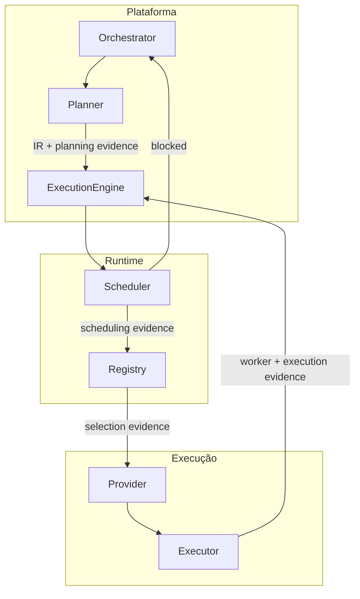

# Contratos — MegaBrain Runtime v2.1

**Versão:** `contracts-v2.1.0` · **Congelado:** 2026-07-02  
**Governança:** [ARCHITECTURAL-PRINCIPLES.md](../ARCHITECTURAL-PRINCIPLES.md)

Pacote de **interfaces estáveis** entre componentes do runtime. Implementações (TypeScript, skills Cursor, CLIs) vivem por detrás destes contratos.

---

## Hierarquia documental

```
ARCHITECTURAL-PRINCIPLES.md   ← regras invioláveis (governança)
        ↓
ecosystem-v2.md               ← PORQUÊ e componentes
        ↓
contracts/                    ← ESTE PACOTE — interfaces v2.1
        ↓
specs/                        ← detalhe implementável v2.0 (algoritmos, YAML)
```

| Pacote | Muda quando | Exemplo |
|--------|-------------|---------|
| `contracts/` | Breaking em interface | MAJOR bump |
| `specs/` | Algoritmo, exemplos, pseudocódigo | MINOR/PATCH |

**Regra:** `contracts/runtime.md` referencia `specs/runtime.md` para algoritmo — não o repete.

---

## Mapa de contratos

| Contrato | Ficheiro | Responsabilidade |
|----------|----------|------------------|
| Runtime | [runtime.md](runtime.md) | I/O, ciclo de vida, state machine |
| Planner | [planner.md](planner.md) | `plan()` / `replan()` → Capability IR |
| Scheduler | [scheduler.md](scheduler.md) | DAG, schedule, invalidação |
| Registry | [registry.md](registry.md) | `select()`, estratégias, ranking |
| Execution | [execution.md](execution.md) | Provider (WHAT) + Executor (HOW) |
| Evidence | [evidence.md](evidence.md) | Schema universal por emissor |
| Versioning | [versioning.md](versioning.md) | Semver, compatibilidade |

---

## Diagrama de interfaces



---

## Teste de integração arquitectural

Checklist **obrigatório** antes de merge de novo provider ou executor:

| Pergunta | Resposta esperada |
|----------|-------------------|
| Quantos contratos core alterar? | **0** (só manifest + implementação) |
| Precisa alterar Scheduler? | Não |
| Precisa alterar Runtime? | Não |
| Emite Evidence do tipo correcto? | Sim — ver [evidence.md](evidence.md) |
| Declara `runtime_compatibility`? | Sim — ver [versioning.md](versioning.md) |
| Executor implementa cancel + timeout + heartbeat? | Sim, ou declara limitações em manifest |

**Meta:** integrar provider novo em **1 manifest + 1 implementação** (ex.: `provider.yaml` + `SKILL.md`).

Se a resposta a qualquer pergunta for "sim, alterar core" — parar e rever o design.

---

## Implementação de referência

| Artefacto | Path |
|-----------|------|
| Execution Engine (TypeScript) | `Cursor/orchestrator/` |
| Contract tests | `Cursor/orchestrator/tests/contracts/` |
| Provider manifests | `Cursor/orchestrator/providers/*/provider.yaml` |

---

## Referências

| Documento | Path |
|-----------|------|
| Princípios | [ARCHITECTURAL-PRINCIPLES.md](../ARCHITECTURAL-PRINCIPLES.md) |
| Arquitectura v2 | [ecosystem-v2.md](../ecosystem-v2.md) |
| Specs v2.0 | [specs/README.md](../specs/README.md) |
