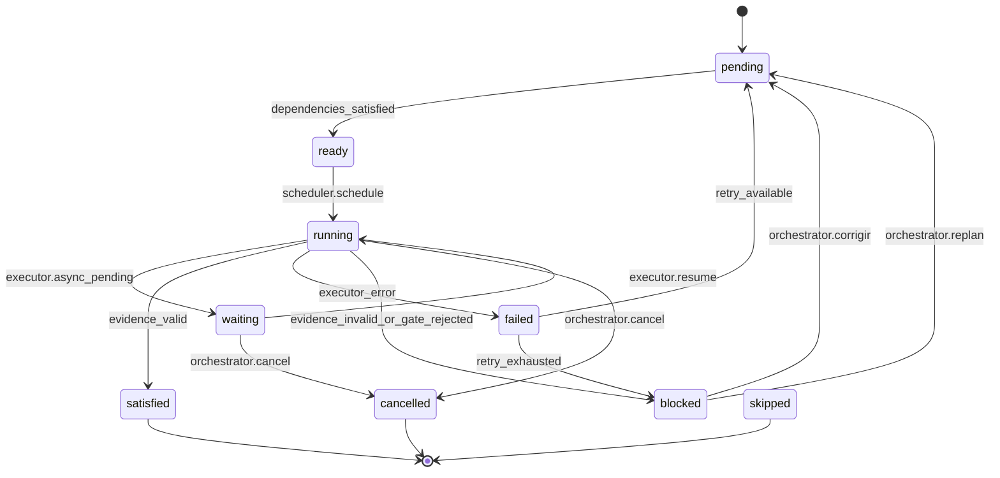

# Runtime Contract

**Pacote:** `contracts-v2.1.0` · **Interface:** `capability-orchestrator/runtime@2.1.0`

Contrato do **Execution Engine** — ciclo de vida, I/O, state machine. Algoritmo detalhado: [specs/runtime.md](../specs/runtime.md).

---

## 1. Responsabilidade

O Runtime é o **motor de execução** da plataforma. Coordena Planner output (IR), Scheduler, Registry, Providers e Evidence. Não implementa capabilities — delega via contratos.

---

## 2. Input — `RunInput`

```yaml
RunInput:
  ir: CapabilityIR              # capability-ir/2.x — ver specs/capability-ir.md
  policy_id: string             # execution-policy/2.x
  feature_id: string
  orchestrator_overrides?: Partial<ExecutionPolicy>
```

---

## 3. Output — `RunResult`

```yaml
RunResult:
  success: boolean
  finished: boolean
  state: completed | blocked | cancelled | active
  blocked_reason?: string
  graph: GraphSnapshot
  evidence: Evidence[]          # todos os emissores — ver evidence.md
  metrics: FeatureMetrics       # telemetry/2.x
  history: Event[]              # append-only
  decision?: continuar | corrigir | replan
```

---

## 4. Ciclo de vida — quem controla o quê

| Acção | Autoridade | Método / transição |
|-------|------------|-------------------|
| Iniciar run | Orchestrator | `engine.run(RunInput)` → run `created` → `active` |
| Pausar run | Orchestrator | `engine.pause(feature_id)` — nós `running` → `waiting` |
| Retomar run | Orchestrator | `engine.resume(feature_id)` — `waiting` → `running` |
| Cancelar nó | Orchestrator ou Policy | `engine.cancel(run_id)` → nó `cancelled` |
| Cancelar run | Orchestrator | `engine.abort(feature_id)` — todos nós → `cancelled`, run `cancelled` |
| Reiniciar nó | Scheduler (após `corrigir`) | invalidação downstream + nó `pending` |
| Replan | Orchestrator | `engine.replan(new_ir)` — graph substituído, run `active` |
| Timeout local | Executor | ver [execution.md](execution.md) → nó `failed` |
| Timeout global | Policy + Engine | `feature_timeout` → run `blocked` |

---

## 5. Semântica de falha

| Evento | Transição (nó) | Quem decide próximo passo |
|--------|----------------|---------------------------|
| Executor timeout | `running` → `failed` | Scheduler (retry?) → Orchestrator |
| Evidence incompleta | `running` → `blocked` | Orchestrator |
| Gate rejected | `running` → `blocked` | Orchestrator (`corrigir`) |
| Retry esgotado | `failed` → `blocked` | Orchestrator (`replan`?) |
| Run concluído | nós `satisfied` + graph finished | run → `completed` |
| Abort | qualquer → `cancelled` | Orchestrator |

---

## 6. State machine

### 6.1 Estados por Run (`FeatureRun`)

| Estado | Significado |
|--------|-------------|
| `created` | Run inicializado, IR ainda não carregado |
| `active` | Engine em loop; pelo menos um nó não terminal |
| `blocked` | Aguarda decisão do Orchestrator |
| `completed` | Todos os nós terminais de sucesso ou skip |
| `cancelled` | Abort explícito |

### 6.2 Estados por Nó (`GraphNode`)

| Estado | Significado |
|--------|-------------|
| `pending` | Aguarda dependências |
| `ready` | Dependências satisfied; elegível para schedule |
| `running` | Executor activo |
| `waiting` | Execução assíncrona pendente (job pickup, human) |
| `satisfied` | Evidence válida; terminal sucesso |
| `failed` | Erro ou retry esgotado |
| `blocked` | Evidence inválida ou gate rejected |
| `skipped` | Policy skip (gate optional) |
| `cancelled` | Cancel explícito |

### 6.3 Diagrama (nó)



### 6.4 Mapa Run ↔ Nós

| Condição dos nós | Estado do Run |
|------------------|---------------|
| Algum `running` ou `waiting` | `active` |
| Algum `blocked` ou `failed` sem decisão | `blocked` |
| Todos `satisfied` ou `skipped` | `completed` |
| Todos `cancelled` | `cancelled` |

---

## 7. Interface `ExecutionEngine`

```typescript
interface ExecutionEngine {
  run(input: RunInput): Promise<RunResult>;
  pause(feature_id: string): Promise<void>;
  resume(feature_id: string): Promise<void>;
  cancel(run_id: string): Promise<void>;
  abort(feature_id: string): Promise<void>;
  replan(ir: CapabilityIR): void;
}
```

---

## 8. Invariantes (MUST)

1. Evidence obrigatória antes de nó → `satisfied` (ver [evidence.md](evidence.md)).
2. Gate `rejected` invalida **apenas** downstream no DAG.
3. Runtime **não** conhece implementações concretas de Executor.
4. Planner **não** é invocado pelo Scheduler — só pelo Orchestrator.
5. `continuar` sem evidence válida é proibido.

---

## 9. Referências

| Documento | Path |
|-----------|------|
| Algoritmo | [specs/runtime.md](../specs/runtime.md) |
| Evidence | [evidence.md](evidence.md) |
| Execution | [execution.md](execution.md) |
| Events | [specs/events.md](../specs/events.md) |
