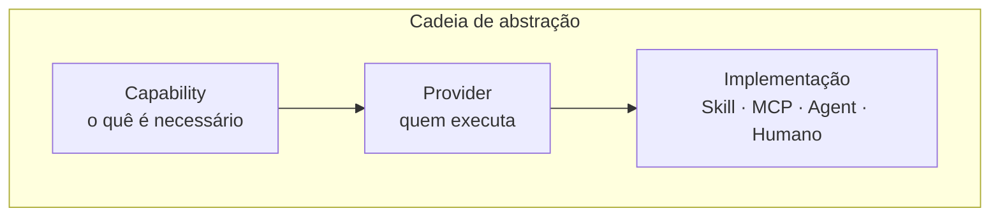
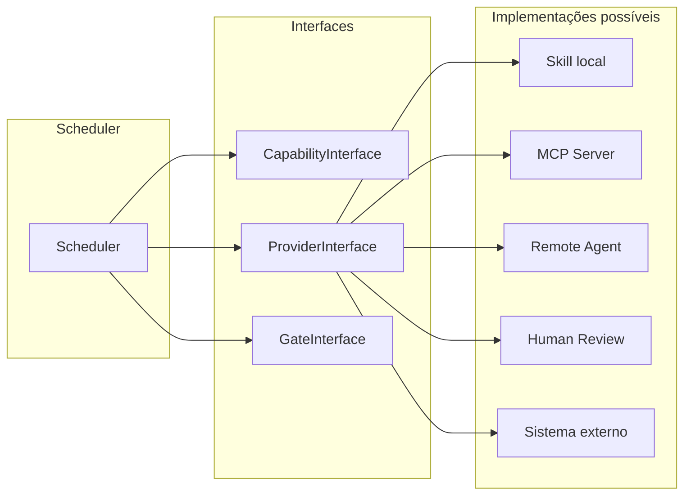
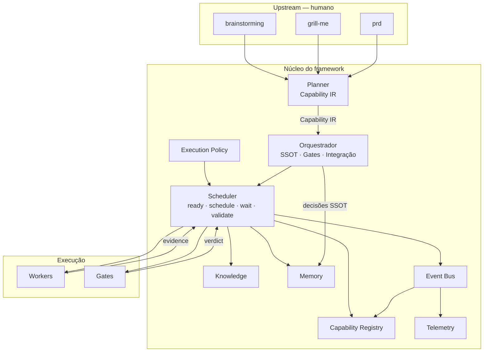
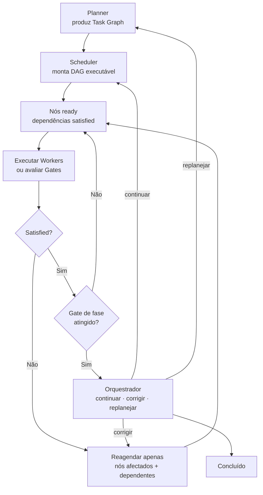
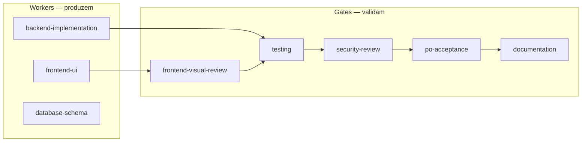

# Orquestrador — Framework de Engenharia para Agentes (v2)

Documento de referência arquitectural **congelado**: paradigma de orquestração baseado em **capacidades**, **contratos** e **composição** — não um catálogo de skills.

Responde: **porquê** e **o quê** (componentes, responsabilidades, paradigma).

Para **como implementar**, ver [specs/README.md](specs/README.md) — documentos normativos separados (runtime, IR, eventos, schemas).

**Estado:** arquitectura congelada em v2.0 — implementação segue specs. O `SKILL.md` actual ainda referencia skills concretas; alinhar na Fase A do roadmap.

**Última actualização:** 2026-06-30 (congelamento + specs v2.0.0)

---

## Índice

0. [Especificações (implementação)](#0-especificações-implementação)
1. [Paradigma](#1-paradigma)
2. [Modelo conceptual](#2-modelo-conceptual)
3. [Componentes da arquitetura](#3-componentes-da-arquitetura)
4. [Task Graph (DAG)](#4-task-graph-dag)
5. [Workers vs Gates](#5-workers-vs-gates)
6. [Capability Registry](#6-capability-registry)
7. [Scheduler](#7-scheduler)
8. [Planner — contrato reduzido](#8-planner--contrato-reduzido)
9. [Orquestrador — papel e responsabilidades](#9-orquestrador--papel-e-responsabilidades)
10. [Knowledge Base (memória de longo prazo)](#10-knowledge-base-memória-de-longo-prazo)
11. [Telemetry / Metrics](#11-telemetry--metrics)
12. [SSOT, PDA e ciclo de vida](#12-ssot-pda-e-ciclo-de-vida)
13. [Upstream — pré-ciclo humano](#13-upstream--pré-ciclo-humano)
14. [Provider mappings (implementação actual)](#14-provider-mappings-implementação-actual)
15. [Extensibilidade e descoberta de Providers](#15-extensibilidade-e-descoberta-de-providers)
16. [Domínios especializados](#16-domínios-especializados)
17. [Exemplo de feature completa](#17-exemplo-de-feature-completa)
18. [Anti-patterns](#18-anti-patterns)
19. [Roadmap de evolução arquitectural](#19-roadmap-de-evolução-arquitectural)
20. [Referências cruzadas](#20-referências-cruzadas)

---

## 0. Especificações (implementação)

Este documento **não cresce** — evoluções normativas vão para `specs/`.

| Pergunta | Documento |
|----------|-----------|
| Qual é o algoritmo do runtime? | [specs/runtime.md](specs/runtime.md) |
| Formato do Task Graph? | [specs/capability-ir.md](specs/capability-ir.md) |
| Retries, gates, estratégias? | [specs/execution-policies.md](specs/execution-policies.md) |
| Selecção dinâmica de providers? | [specs/registry.md](specs/registry.md) |
| Como declarar um provider? | [specs/provider-manifest.md](specs/provider-manifest.md) |
| Plugin architecture? | [specs/plugins.md](specs/plugins.md) |
| Versionamento de contratos? | [specs/contracts.md](specs/contracts.md) |
| Modelo de eventos? | [specs/events.md](specs/events.md) |
| Schema de evidência? | [specs/evidence.md](specs/evidence.md) |
| Knowledge vs Memory? | [specs/knowledge-memory.md](specs/knowledge-memory.md) |
| Métricas e agregação? | [specs/telemetry.md](specs/telemetry.md) |
| APIs internas? | [specs/interfaces.md](specs/interfaces.md) |

**Fluxo de leitura:** `ecosystem-v2.md` → `specs/runtime.md` → restantes specs por necessidade.

---

## 1. Paradigma

### Antes vs depois

| Antes (v1) | Depois (v2) |
|------------|-------------|
| Skills como unidade central | **Capabilities** como unidade central |
| Pipeline linear por fases | **DAG** de dependências com reagendamento parcial |
| Planner decide ordem, paralelismo, skills | Planner produz **Task Graph**; **Scheduler** decide execução |
| Orquestrador conhece `backend`, `frontend`, `testing` | Orquestrador depende de **Interfaces** e **Registry** |
| `.agent_history.md` como log | **Knowledge Base** persistente + log operacional |
| Saber se executou/falhou | **Telemetry** para evolução baseada em dados |

### Princípio fundacional

> O crescimento do ecossistema não deve acontecer pela criação contínua de novas Skills.
> Deve acontecer por novas **Capacidades**, novos **Providers**, novos **Contratos**, novas **Interfaces** e novas **Estratégias de Orquestração**.

Skills são **uma implementação possível** de um Provider — não o centro da arquitectura.



### O que o framework enfatiza

- **Arquitectura** — componentes com responsabilidades delimitadas
- **Contratos** — inputs, outputs, DoD, evidências
- **Estados** — ciclo de vida de cada nó do grafo
- **Composição** — features = grafos de capacidades, não sequências fixas
- **Desacoplamento** — Scheduler nunca depende de nomes concretos de skills
- **Extensibilidade** — trocar Provider sem alterar Orquestrador
- **Governança** — gates com evidência, telemetria, knowledge base

---

## 2. Modelo conceptual

### Capability (capacidade)

Unidade atómica de trabalho **semântica** — descreve *o que* precisa de ser feito, não *como* nem *quem*.

Exemplos: `api-design`, `backend-implementation`, `database-schema`, `frontend-ui`, `accessibility`, `localization`, `performance-audit`, `security-review`, `testing`, `documentation`.

Uma feature complexa pode exigir **dezenas** de capacidades. O Planner **não** produz uma lista de skills — produz um **Capability Graph** (Task Graph) onde cada nó é uma capacidade com contratos explícitos.

### Provider (fornecedor)

Entidade que **implementa** uma ou mais capacidades. O Scheduler resolve Capability → Provider via **Capability Registry**.

Exemplo actual:

```
Capability: frontend-ui
    ↓
Provider: frontend-pro
    ↓
Implementação: .cursor/skills/frontend-pro/SKILL.md
```

Amanhã o Provider pode ser outro — o Scheduler **não** muda.

### Interface

Contrato que o Scheduler consome. O Scheduler depende **apenas** de Interfaces — nunca de implementações concretas.



### Skill

Implementação concreta de um Provider no ecossistema Cursor — ficheiro `SKILL.md` com instruções normativas. **Um Provider pode ter múltiplos modos** (ex.: `frontend-pro` → Build | Review | Vision | Fix | Audit) sem criar novas capacidades.

### Contrato de nó (Task Node)

Cada nó do Task Graph transporta:

| Campo | Responsável | Descrição |
|-------|-------------|-----------|
| `capability` | Planner | Identificador semântico (ex.: `backend-implementation`) |
| `inputs` | Planner | Artefactos, contexto, dependências de dados |
| `outputs` | Planner | Artefactos esperados, paths, formatos |
| `dependencies` | Planner | IDs de nós predecessoras |
| `definition_of_done` | Planner | Critérios verificáveis de conclusão |
| `type` | Planner | `worker` ou `gate` |
| `provider` | **Scheduler** | Resolvido via Registry |
| `status` | **Scheduler** | `pending \| running \| satisfied \| failed \| blocked \| skipped` |
| `evidence` | Worker/Gate | Artefactos que comprovam conclusão |

---

## 3. Componentes da arquitetura



| Componente | Papel | Não faz |
|------------|-------|---------|
| **Planner** | Produz **Capability IR** — capacidades, contratos, dependências, DoD | Escolher providers, ordem, paralelismo, retries, policy |
| **Execution Policy** | Retries, gates obrigatórios, estratégia de provider, paralelismo | Executar nós, alterar IR |
| **Scheduler** | Loop runtime: ready → schedule → wait → validate ([runtime.md](specs/runtime.md)) | Decidir policy, SSOT, implementar código |
| **Orquestrador** | SSOT, `continuar \| corrigir \| replanejar`, gates de fase | Scheduling, provider selection |
| **Capability Registry** | Base activa: providers, scores, telemetria, estratégias de selecção | Executar tarefas |
| **Knowledge** | Permanente — patterns, pitfalls, decisions | Contexto de feature |
| **Memory** | Contextual por feature — preferências, micro-decisões | Conhecimento durável |
| **Event Bus** | Eventos append-only — runtime dirigido por eventos | Lógica de negócio |
| **Telemetry** | Agregação de eventos → métricas | Decisões em runtime |

---

## 4. Task Graph (DAG)

### Por que DAG e não pipeline linear

Software funciona como grafo de dependências. Quando Testing reprova algo, **não** faz sentido reiniciar toda a pipeline — apenas os nós dependentes voltam a execução.

As **fases** (1–6) continuam a existir como **Gates de alto nível** — marcos de convergência no SSOT. A execução interna é sempre um DAG.

### Ciclo de execução



### Estados de nó

| Estado | Significado | Transição |
|--------|-------------|-----------|
| `pending` | Aguarda dependências | → `running` quando deps satisfied |
| `running` | Provider em execução | → `satisfied` ou `failed` |
| `satisfied` | DoD cumprido com evidência | Terminal (até invalidação) |
| `failed` | Falhou após retries | → reagendamento ou escalada |
| `blocked` | Impossível prosseguir | → Orquestrador decide |
| `skipped` | Não aplicável nesta feature | Terminal |

### Invalidação parcial

Quando um Gate reprova (ex.: `testing` falha, `po-review` pede ajustes):

1. Scheduler identifica o nó que falhou
2. Marca como `failed` ou `blocked`
3. Propaga invalidação **apenas** para descendentes no DAG
4. Reagenda nós afectados — workers upstream intactos permanecem `satisfied`

Exemplo: `testing` falha → invalida `security-review`, `po-review`, `documentation` → reexecuta apenas `backend-implementation` ou `frontend-ui` (conforme causa) → revalida gates downstream.

### Paralelismo

O Scheduler detecta nós **ready** simultaneamente (dependências satisfied, sem conflito de recursos) e agenda execução paralela.

```
Após nó `api-contract` satisfied:
  ├── worker: backend-implementation  (paralelo)
  └── worker: frontend-ui               (paralelo)

Ambos satisfied → gate: frontend-visual-review → gate: testing
```

---

## 5. Workers vs Gates

Distinção **obrigatória** — não misturar responsabilidades.

### Workers

**Produzem artefactos.** Implementam, constroem, modificam.

| Capability (exemplo) | Provider actual | Tipo |
|----------------------|-----------------|------|
| `backend-implementation` | `backend` | Worker |
| `frontend-ui` | `frontend-pro` (modo Build/Vision) | Worker |
| `database-schema` | `database` ou `backend` | Worker |
| `api-contract` | `planner` (sub-task) ou provider dedicado | Worker |
| `devops-deploy` | `devops` | Worker |

### Gates

**Validam artefactos.** Não implementam — emitem veredito com evidência.

| Capability (exemplo) | Provider actual | Tipo |
|----------------------|-----------------|------|
| `testing` | `testing` (a criar) | Gate |
| `frontend-visual-review` | `frontend-pro` (modo Review/Audit) | Gate |
| `security-review` | `security` | Gate |
| `po-acceptance` | `po-review` | Gate |
| `documentation` | `documentation` | Gate |



### Regras

- Workers **nunca** aprovam o próprio output como gate final
- Gates **nunca** implementam código ou UI
- Um Provider pode expor **modos** Worker e Gate (ex.: `frontend-pro` Build = Worker, Review = Gate)
- Gates de fase (Fase 3, 4, 5, 6) são convergências no SSOT — o Orquestrador só avança com evidência

---

## 6. Capability Registry

Base de dados **activa** do ecossistema — gerada de `provider.yaml` + telemetria runtime.

O Scheduler selecciona providers por **estratégia** (`stable`, `fastest`, `cheapest`, `highest_quality`, `experimental`) — não apenas `priority`.

Campos dinâmicos: `quality_score`, `success_rate`, `average_duration_ms`, `last_success`, `rework_rate`.

**Especificação completa:** [specs/registry.md](specs/registry.md), [specs/provider-manifest.md](specs/provider-manifest.md)

---

## 7. Scheduler e Execution Policy

O **Scheduler** executa o loop runtime — **não** decide comportamento global. Isso é **Execution Policy**.

```
Planner → Capability IR → Execution Policy → Scheduler → Providers
```

| Scheduler faz | Policy decide |
|---------------|---------------|
| `ready_nodes()` | `retries`, `max_parallel` |
| `schedule()` | `provider_strategy` |
| `wait()` / `validate()` | `gate required/skipped` |
| `invalidate_downstream()` | `on_gate_reject` |
| Emitir eventos | `fail_fast`, timeouts |

**Algoritmo completo:** [specs/runtime.md](specs/runtime.md)

**Policies predefinidas:** [specs/execution-policies.md](specs/execution-policies.md) — `high-reliability`, `rapid-prototype`, `experimental`, `cost-optimized`

---

## 8. Planner — Capability IR

O Planner produz **Capability IR** (Intermediate Representation) — linguagem intermédia oficial entre intenção e execução.

**Schema normativo:** [specs/capability-ir.md](specs/capability-ir.md)

O Planner **não** decide ordem, paralelismo, retries, providers, policy nem reagendamento. Produz **apenas**:

### Output obrigatório

```yaml
task_graph:
  nodes:
    - id: contract-1
      capability: api-contract
      type: worker
      inputs: [feature-spec, existing-api-surface]
      outputs: [docs/contracts/login-api.md]
      dependencies: []
      definition_of_done:
        - Contrato OpenAPI ou equivalente documentado
        - Endpoints, schemas, erros definidos

    - id: be-auth
      capability: backend-implementation
      type: worker
      inputs: [contract-1.outputs]
      outputs: [src/auth/, tests/unit/auth/]
      dependencies: [contract-1]
      definition_of_done:
        - Endpoints do contrato implementados
        - Testes unitários passam

    - id: fe-login
      capability: frontend-ui
      type: worker
      inputs: [contract-1.outputs, design-spec]
      outputs: [src/pages/login/, src/components/]
      dependencies: [contract-1]
      definition_of_done:
        - UI conforme spec
        - Consome API conforme contrato

    - id: fe-review
      capability: frontend-visual-review
      type: gate
      inputs: [fe-login.outputs]
      outputs: [.frontend-review/<date>-login/]
      dependencies: [fe-login]
      definition_of_done:
        - Screenshot real capturado
        - Relatório visual gerado

    - id: test-suite
      capability: testing
      type: gate
      inputs: [be-auth.outputs, fe-login.outputs]
      outputs: [test-report.json]
      dependencies: [be-auth, fe-login]
      definition_of_done:
        - Suite verde
        - Cobertura mínima conforme stack

  # NÃO incluir: provider, order, parallelism, retries
  # Isso é responsabilidade do Scheduler
```

### O Planner **não** produz

| Proibido | Quem faz |
|----------|----------|
| Lista de skills | Scheduler via Registry |
| Ordem de execução | Scheduler via DAG |
| Decisão de paralelismo | Scheduler |
| Escolha de provider | Scheduler via Registry |
| Retries / reagendamento | Scheduler |
| Decisões SS, continuar | corrigir | replanejar` | Orquestrador |

### Tipos de nó que o Planner pode emitir

| Tipo nó | Capability examples | Notas |
|---------|---------------------|-------|
| `worker` | `api-contract`, `backend-implementation`, `database-schema`, `frontend-ui`, `devops-deploy`, `research` | Produz artefactos |
| `gate` | `testing`, `frontend-visual-review`, `security-review`, `po-acceptance`, `documentation` | Valida com veredito |

### Integração upstream

O Planner **consome** artefactos upstream (spec, PRD, ADR) como inputs — não os produz. Produção upstream é responsabilidade de capacidades humanas ou workers dedicados (secção 13).

---

## 9. Orquestrador — papel e responsabilidades

O Orquestrador é o **SSOT** — decide, delega, integra, decide de novo. **Não** implementa código longo, review visual detalhado nem documentação extensa.

### Responsabilidades

| # | Responsabilidade | Descrição |
|---|------------------|-----------|
| 1 | **SSOT** | `[ESTADO ATUAL]`, `[PLANO]`, matriz `continuar \| corrigir \| replanejar` |
| 2 | **Integração** | Consolidar `[ENTREGA CONSOLIDADA]` dos filhos |
| 3 | **Gates de fase** | Convergência Fase 3–6 — nunca avançar sem evidência |
| 4 | **Consistência de contratos** | Único agente que cruza API ↔ UI ↔ testes ↔ PO |
| 5 | **Delegação PDA** | Spawn subagentes + Briefing Relâmpago |
| 6 | **Reidratação** | `.agent_history.md` + Knowledge Base |
| 7 | **Escalada** | Receber bloqueios do Scheduler e decidir |

### Orquestrador vs Scheduler

| Orquestrador | Scheduler |
|--------------|-----------|
| Decisões estratégicas | Decisões tácticas de execução |
| SSOT e gates de fase | DAG, paralelismo, retries |
| `continuar \| corrigir \| replanejar` | Provider selection, reagendamento |
| Integração cross-domain | Spawn e monitorização de workers/gates |
| Interface com utilizador | Interface com Registry e Knowledge Base |

### Fases como Gates de alto nível

As fases persistem como **marcos de convergência** no SSOT — não como pipeline linear.

| Fase | Gate de convergência | Capabilities típicas |
|------|----------------------|----------------------|
| **Pré** | Spec/PRD aprovados (humano) | `product-discovery`, `design-stress-test` |
| **0** | Capability gap resolvido | `provider-discovery` |
| **1** | Task Graph produzido | `planning` |
| **2** | Workers de implementação satisfied | `backend-implementation`, `frontend-ui`, `database-schema` |
| **2.5** | Gate visual satisfied | `frontend-visual-review` |
| **3** | Gate testing satisfied | `testing` |
| **4** | Gate security satisfied | `security-review` |
| **5** | Gate PO satisfied | `po-acceptance` |
| **6** | Gate documentation satisfied | `documentation` |

---

## 10. Knowledge, Memory e Log

Três níveis distintos — **não misturar**.

| Nível | Path | Natureza | Exemplo |
|-------|------|----------|---------|
| **Knowledge** | `knowledge/` | Permanente, reutilizável | "JWT funciona melhor neste projecto" |
| **Memory** | `memory/<feature_id>/` | Contextual por feature | "Utilizador pediu botão azul" |
| **Log** | `.agent_history.md` | Operacional, reidratação | "Fase 3: corrigir be-auth" |

**Especificação:** [specs/knowledge-memory.md](specs/knowledge-memory.md)

---

## 11. Telemetry / Events

Runtime **dirigido por eventos** — Telemetry agrega eventos em métricas.

**Especificações:** [specs/events.md](specs/events.md), [specs/telemetry.md](specs/telemetry.md)

Eventos chave: `NodeCompleted`, `GateRejected`, `ProviderSelected`, `RetryScheduled`, `PlannerReplan`, `KnowledgeHit`, `FeatureCompleted`.

Métricas derivadas: `planner.accuracy`, `task.rework_rate`, `gate.po_rejection_rate`, `provider.quality_score`, `quality.kb_hit_rate` — ver spec completa.

---

## 12. SSOT, PDA e ciclo de vida

### SSOT (Single Source of Truth)

O Orquestrador mantém:

- `[ESTADO ATUAL]` — fase, nós satisfied/failed, decisões pendentes
- `[PLANO]` — Task Graph (produzido pelo Planner, **não** alterado pelo Scheduler)
- Matriz `continuar | corrigir | replanejar`
- Gates de fase — convergência com evidência

### PDA (Protocolo de Delegação Autônoma)

Inalterado em espírito — adaptado ao modelo de capabilities:

1. Scheduler identifica nó ready → resolve Provider via Registry
2. Orquestrador (ou Scheduler) emite **Briefing Relâmpago** com capability, contrato, inputs, DoD
3. Subagente executa **sem** conhecer o grafo completo — só o seu nó
4. Retorna `[ENTREGA CONSOLIDADA]` + evidence
5. Scheduler avalia DoD → actualiza estado do nó

### `.agent_history.md` vs Knowledge Base

| | `.agent_history.md` | `knowledge/` |
|--|---------------------|--------------|
| **Propósito** | Log operacional da sessão/feature | Conhecimento reutilizável |
| **Granularidade** | Entrada por decisão/evento | Pattern/decision/pitfall |
| **Consulta** | Reidratação de contexto | Prevenção de rework |
| **Retenção** | Append-only por feature | Curado, versionado |
| **Quem escreve** | Orquestrador | Orquestrador + Workers (learnings) |

### Subagentes

| `subagent_type` | Usar para |
|-----------------|-----------|
| **generalPurpose** | Workers (backend, frontend-pro, security, documentation) |
| **generalPurpose isolado** | Gate `po-acceptance` (adversarial — outro chat) |
| **explore** | Capability `research` — mapear repo sem poluir raiz |
| **shell** | Execução de testes, build, lint |
| **ci-investigator** | Após retries esgotados em gate `testing` |

### Regras de delegação

| Situação | Delegar? |
|----------|----------|
| Nó Worker M/L no Task Graph | Sim |
| BE + FE após `api-contract` satisfied | **2 subagentes paralelos** |
| Gate visual (`frontend-visual-review`) | Sim — implementador não aprova o próprio código |
| Gate `po-acceptance` | **Sempre isolado** |
| Upstream humano (brainstorming, grilling) | **Não** — pausar orquestrador |
| Fix trivial 1 ficheiro | Excepção estreita no raiz |

---

## 13. Upstream — pré-ciclo humano

Actividades **antes** do Task Graph — produzem artefactos que o Planner consome como inputs.

| Capability | Provider actual | Tipo | Humano? |
|------------|-----------------|------|---------|
| `product-discovery` | `brainstorming` | Upstream | Sim — diálogo |
| `design-stress-test` | `grill-me` (autoridade; sem skill `grilling` separada) | Upstream | Sim — HITL; **HARD-GATE** condicional antes de planner |
| `systematic-debug` | **`debugger`** (absorve Tier3 `systematic-debugging`) | Gate testing: retries esgotados | |
| `plan-execution` | PDA `exec` + workers (`/backend`, …) — **não** `executing-plans` no path canónico | Plano IR | |
| `provider-discovery` (humano) | `find-skills` / `/descobrir` | Descoberta externa | User-facing |
| `provider-discovery` (engine) | `provider-discovery.ts` scan `provider.yaml` | Registry miss | Runtime TS |
| `business-requirements` | `prd` (Tier 2) | Upstream | Parcial |
| `architecture-decision` | `adr` (Tier 2) | Upstream | Parcial |

Estas **não** são fases do Scheduler — são gates humanos antes de Fase 1.

### Cadeia upstream recomendada

```
brainstorming (opcional, global) → prd (pacote docs/, HARD-GATE aprovação)
    → grill-me (HARD-GATE condicional — grill-me-gate.md) → planner (Fase 1) → Fase 2 código
```

**HARD-GATE:**  
`brainstorming` proíbe código até design aprovado. **`prd`** proíbe planner/implementação até pacote docs aprovado.  
**`grill-me`** proíbe planner quando `require[]` o inclui e evidência ≠ `satisfied|exempt` (fail-closed).  
**`knowledge-grounding`** proíbe planner/implementação MegaBrain até retrieve wiki+RAG (`applied` ou `skipped_trivial`).  
**`GATE_BUNDLE`** é obrigatório em todo spawn PDA (herança de hard-gates); ver [gate-bundle.md](gate-bundle.md) + [pda-roles.md](pda-roles.md).

**Regra:** grill-me/brainstorming **nunca** correm em loop autónomo silencioso — pausar orquestrador, registar `aguarda humano` em `.agent_history.md`.

---

## 14. Provider mappings (implementação actual)

Mapeamento **actual** Capability → Provider → Skill. Amanhã qualquer linha pode mudar **sem alterar o Scheduler**.

### Tier 1 — Providers activos no repo

| Capability | Provider | Implementação | Tipo | Estado |
|------------|----------|---------------|------|--------|
| `orchestration` | `orquestrar` | `.cursor/skills/orquestrar/SKILL.md` | — | ✓ |
| `planning` | `planner` | `.cursor/skills/planner/SKILL.md` | Worker | ✓ |
| `backend-implementation` | `backend` | `.cursor/skills/backend/SKILL.md` | Worker | ✓ |
| `frontend-ui` | `frontend-pro` | `.cursor/skills/frontend-pro/SKILL.md` | Worker | ✓ |
| `frontend-visual-review` | `frontend-pro` | idem (modo Review/Audit) | Gate | ✓ |
| `testing` | `testing` | *a criar* | Gate | ✗ |
| `security-review` | `security` | `.cursor/skills/security/SKILL.md` | Gate | ✓ |
| `po-acceptance` | `po-review` | `.cursor/skills/po-review/SKILL.md` | Gate | ✓ |
| `documentation` | `documentation` | `.cursor/skills/documentation/SKILL.md` | Gate | ✓ |
| `skill-authoring` | `skill-authoring` | `.cursor/skills/skill-authoring/SKILL.md` | Meta | ✓ |

### Tier 2 — Providers condicionais (activos)

| Capability | Provider | Implementação | Trigger no Task Graph | Output verificável | Estado |
|------------|----------|---------------|----------------------|-------------------|--------|
| `database-schema` | `database` | `.cursor/skills/database/SKILL.md` | Nó tagged `database`; schema complexo | `schema/`, migrações, ER | ✓ |
| `business-requirements` | `prd` | `.cursor/skills/prd/SKILL.md` | Feature com stakeholders | Pacote `docs/` completo | ✓ |
| `architecture-decision` | `adr` | `.cursor/skills/adr/SKILL.md` | Decisão irreversível | `docs/adr/NNNN-<titulo>.md` | ✓ |
| `devops-deploy` | `devops` | `.cursor/skills/devops/SKILL.md` | DoD inclui deploy/CI | Pipeline verde, runbook | ✓ |

### Tier 3 — Providers globais (`~/.agents/skills/`)

Resolvidos via Registry com `implementation: skill` e path global. Activados pelo Scheduler quando capability não tem provider local.

| Capability | Provider global | Quando |
|------------|-----------------|--------|
| `product-discovery` | `brainstorming` | Pré-ciclo |
| `design-stress-test` | `grill-me` | Pré-ciclo (**HARD** condicional) |
| `debug` | `debugger` (fonte DO: `systematic-debugging`) | Gate testing: retries esgotados |
| `planning` | `planner` | Fase 1 canónica (≠ `writing-plans`) |
| `provider-discovery` (user) | `find-skills` | `/descobrir` — **não** Scheduler TS |
| `visual-generation` | `image-to-code` | HARD-GATE imagem anexada |
| `context-grounding` | `wiki` | HARD-GATE Fase 0 |
| `browser-automation` | `agent-browser` | FE fallback / dossier HARD |
| `visual-generation` | `image-to-code` | **HARD-GATE:** qualquer imagem anexada pelo utilizador; frontend-pro Vision |
| `knowledge-grounding` | `wiki` / CLI `wiki-ingest` / vault | **HARD-GATE MegaBrain:** wiki + RAG (BM25/híbrido/LanceDB/packs) antes de planear/implementar; ver [knowledge-grounding-gate.md](knowledge-grounding-gate.md) |
| `browser-automation` | `agent-browser` | Fluxos browser complexos |

### Modos de Provider (evitar novas capabilities)

| Provider | Modos | Evita |
|----------|-------|-------|
| `frontend-pro` | Build \| Review \| Vision \| Fix \| Audit | `ui-review`, `landing-agent` |
| `documentation` | readme \| api-reference \| onboarding \| architecture \| changelog | `technical-writer` |
| `backend` | default \| delega `database` | Duplicar ORM patterns |
| `po-review` | default \| `com-evidencia-visual` | Segundo agente aceite |

### Comandos `/` (invocação humana)

Comandos são **atalhos de invocação** — não definem arquitectura.

| Comando | Capability | Provider |
|---------|------------|----------|
| `/MegaBrain` | `orchestration` | `orquestrar` |
| `/planejar` | `planning` | `planner` |
| `/backend` | `backend-implementation` | `backend` |
| `/frontend` | `frontend-ui` | `frontend-pro` |
| `/frontend-review` | `frontend-visual-review` | `frontend-pro` |
| `/testes` | `testing` | `testing` ⚠ |
| `/seguranca` | `security-review` | `security` |
| `/validar` | `po-acceptance` | `po-review` |
| `/documentar` | `documentation` | `documentation` |
| `/prd` | `business-requirements` | `prd` |
| `/adr` | `architecture-decision` | `adr` |
| `/database` | `database-schema` | `database` |
| `/devops` | `devops-deploy` | `devops` |
| `/descobrir` | discovery user-facing | `find-skills` (≠ TS Registry fallback) |
| `/grill-me` | `design-stress-test` | `grill-me` |

### Diagnóstico — lacunas actuais

| Capability | Provider esperado | Estado | Acção |
|------------|-------------------|--------|-------|
| `frontend-ui` | `frontend` (legado no SKILL.md) | ✗ path incorrecto | Registry → `frontend-pro` |
| `testing` | `testing` | ✗ não existe | Criar provider local |
| Comandos `/` | — | Parcial | Criar `/MegaBrain`, `/planejar`, etc. |

---

## 15. Extensibilidade e descoberta de Providers

### find-skills → user-facing discovery (NOT engine fallback)

`find-skills` + `/descobrir` implementam **descoberta humana** de skills externas (`npx skills`).

O **fallback do Scheduler/Execution Engine** quando o Registry não tem provider é:

```text
discoverManifestForCapability → scan .cursor/skills/*/provider.yaml (+ orchestrator/providers)
```

Homónimo histórico: o módulo TS chama-se `provider-discovery.ts` — **não** invoca a skill `find-skills`.


**Gatilhos:**

1. Task Graph inclui capability sem provider no Registry
2. Nó `research` identifica gap de capability
3. Gate `testing` falha por ausência de infra de testes

**Fluxo:**

```bash
npx skills find <capability-query>
npx skills add <owner/repo@skill> -g -y  # só com OK explícito
# → registar novo provider no Capability Registry
```

### Critério de escolha de provider externo

| Preferir | Evitar |
|----------|--------|
| Providers que implementam capability **distinta** | Duplicar capability já coberta |
| Fontes oficiais (vercel-labs, anthropics, obra) | <100 installs sem reputação |
| 1K+ installs | Substituir provider local sem eval |

### Catálogo de referência (skills.sh)

Instalar **sob demanda** via `provider-discovery` — não pré-carregar.

#### testing (prioridade — capability sem provider local)

| Provider candidato | Installs | Install |
|--------------------|----------|---------|
| `anthropics/skills@webapp-testing` | 107K | `npx skills add anthropics/skills@webapp-testing -g -y` |
| `wshobson/agents@python-testing-patterns` | 26K | Backend Python |

**Recomendação:** criar provider local `testing` via `/skill-authoring`; usar `webapp-testing` como fallback no Registry.

#### database

| Provider candidato | Installs | Install |
|--------------------|----------|---------|
| `planetscale/database-skills@mysql` | 5.6K | MySQL / PlanetScale |
| `manutej/luxor-claude-marketplace@postgresql-database-engineering` | 1.3K | Postgres |

#### PRD / ADR

| Provider candidato | Installs | Capability |
|--------------------|----------|------------|
| `deanpeters/product-manager-skills@prd-development` | 2.6K | `business-requirements` |
| `giuseppe-trisciuoglio/developer-kit@adr-drafting` | 1K | `architecture-decision` |

#### Complementares (não substituem providers locais)

| Provider | Installs | Capability |
|----------|----------|------------|
| `vercel-labs/agent-skills@vercel-react-best-practices` | 515K | `performance-audit` |
| `obra/superpowers@systematic-debugging` | 166K | `systematic-debug` |
| `wshobson/agents@api-design-principles` | 24K | `api-contract` |

### Regra de ouro para novos Providers

Antes de registar provider no pipeline AGENTS:

| # | Pergunta | Se «não» → |
|---|----------|------------|
| 1 | Implementa **capability distinta** no Registry? | Modo num provider existente |
| 2 | Tem **output verificável** distinto? | Contrato no Planner, não provider |
| 3 | A **description** dispara em contextos distintos? | Fundir com provider existente |
| 4 | Vale **evals isolados**? | Provider global ou referência |

Passar em **3 de 4** → Tier 2. Passar em **4 de 4** → Tier 1.

### Filosofia: capability vs provider vs modo

| Abordagem | Prós | Contras |
|-----------|------|---------|
| 1 provider = 1 micro-acção | Papel claro | Registry explode; overlap |
| 1 provider = 1 capability | Escalável; Scheduler desacoplado | Exige Registry disciplinado |
| Modos dentro de provider | Variantes sem novo Registry entry | Provider pode ficar grande |

**Princípio:** crescimento por **capabilities** no Task Graph e **providers** no Registry — não por multiplicação de skills.

---

## 16. Domínios especializados

Mapa de capabilities de domínio — cada uma resolve via Registry, não via skill monolítica.

| Domínio | Capability | Provider actual | Criar provider? |
|---------|------------|-----------------|-----------------|
| PRD / spec | `business-requirements` | `prd` | ✓ |
| Decisões | `architecture-decision` | `adr` | ✓ |
| Banco de dados | `database-schema` | `database` (delegável de backend) | ✓ |
| Documentação | `documentation` | `documentation` | Modos, não nova skill |
| Onboarding dev | `documentation` modo `onboarding` | `documentation` | Não — ver abaixo |
| Onboarding produto | `frontend-ui` | `frontend-pro` | Fora do ciclo dev |
| UI / UX | `frontend-ui` + `frontend-visual-review` | `frontend-pro` | — |
| Testes | `testing` | ✗ | **Prioridade máxima** |
| Deploy | `devops-deploy` | `devops` | ✓ |

### Onboarding — duas capabilities distintas

| Capability | Significado | Provider |
|------------|-------------|----------|
| `frontend-ui` (tipo produto) | Signup, activação, CRO | `frontend-pro` + marketing skills |
| `documentation` (modo onboarding) | README, setup local, primeiro dev run | `documentation` |

Task Graph **deve** declarar `onboarding_type: dev | produto` — Scheduler resolve provider correcto.

### Relação upstream × gates

| Capability | Momento | Output | Humano? |
|------------|---------|--------|---------|
| `design-stress-test` | Antes do Task Graph | Plano validado | Sim |
| `architecture-decision` | Após decisão fechada | `docs/adr/` | Parcial |
| `po-acceptance` | Após gates satisfied | OK \| Ajustes | Não — subagente isolado |

---

## 17. Exemplo de feature completa

**Pedido:** "Feature login + dashboard"

### Task Graph (produzido pelo Planner)

```
nodes:
  contract-1:     api-contract          [worker]  deps: []
  be-auth:        backend-implementation [worker]  deps: [contract-1]
  fe-login:       frontend-ui           [worker]  deps: [contract-1]
  fe-dashboard:   frontend-ui           [worker]  deps: [contract-1, fe-login]
  fe-review:      frontend-visual-review [gate]   deps: [fe-login, fe-dashboard]
  test-suite:     testing               [gate]   deps: [be-auth, fe-login, fe-dashboard]
  sec-audit:      security-review       [gate]   deps: [test-suite]
  po-accept:      po-acceptance         [gate]   deps: [fe-review, test-suite, sec-audit]
  docs:           documentation         [gate]   deps: [po-accept]
```

### Execução (Scheduler)

```
1. [Upstream] brainstorming? → /prd → /grill-me (HARD se require)
2. Orquestrador → Planner produz Task Graph
3. Scheduler:
     contract-1 → satisfied
     ├── be-auth ∥ fe-login        (paralelo)
     fe-dashboard (após fe-login)
     fe-review (gate)
     test-suite (gate) → falha → reagenda be-auth → satisfied → revalida
     sec-audit (gate)
     po-accept (gate, isolado)
     docs (gate)
4. Orquestrador: `/validar` (po-review) → `/documentar` (fecho canónico; ≠ `finishing-a-development-branch` Superpowers)
5. Telemetry + learnings → Knowledge Base
```

### Invalidação em acção

Testing falha por bug em `be-auth`:
- Scheduler invalida: `test-suite`, `sec-audit`, `po-accept`, `docs`
- Reagenda: `be-auth` only
- `fe-login`, `fe-dashboard`, `fe-review` permanecem satisfied
- Após `be-auth` satisfied → revalida gates downstream

---

## 18. Anti-patterns

| Evitar | Porquê |
|--------|--------|
| Planner escolher skills/providers | Viola separação Planner/Scheduler |
| Pipeline linear sem DAG | Reexecuta tudo desnecessariamente |
| Gate que implementa código | Gates validam — Workers produzem |
| Worker que auto-aprova | Complacência — gate separado |
| Orquestrador conhecer skills por nome | Acoplamento — usar Registry |
| Nova skill por micro-acção | Crescimento por capability + provider |
| `.agent_history.md` como knowledge | Log ≠ conhecimento reutilizável |
| `continuar` sem evidência | Gate sem veredito verificável |
| PO na mesma sessão que implementou | Gate `po-acceptance` isolado existe para isto |
| Instalar 20 providers de uma vez | Registry poluído; conflito de triggers |
| Substituir Orquestrador por orchestkit | Perdes SSOT, PDA, Knowledge Base customizados |
| Capability sem DoD no Task Graph | Scheduler não consegue avaliar satisfied |
| Ignorar telemetria | Evolução às cegas |
| UI com imagem anexada sem `image-to-code` | Viola [image-attachment-gate.md](image-attachment-gate.md) — qualquer agente |
| Build genérico com mockup no chat | Usar Vision + `~/.agents/skills/image-to-code/SKILL.md` |
| `/MegaBrain` planear/codar sem retrieve wiki/RAG | Viola [knowledge-grounding-gate.md](knowledge-grounding-gate.md) |
| Inventar contratos Gaab ou omitir `log.md` pós-edit | Viola HARD-GATE Wiki + rule `wiki-agent` |
| Erro de gate → reboot cego Fase 0 sempre | Viola [outer-loop.md](outer-loop.md) — usar partial/plan_reset/full_ground |
| Outer loop sem teto / sem SSOT cycle_id | Viola outer-loop — max_outer_cycles + handoff |
| Spawn PDA sem GATE_BUNDLE | Viola [gate-bundle.md](gate-bundle.md) — filho deve recusar |
| Filho ignora role ou hard-gates herdados | Viola [pda-roles.md](pda-roles.md) — rejeitar entrega |
| spawn_depth > 3 | Viola max_spawn_depth — bloquear novo spawn |
| Spawn PDA / Fase 1 sem Policy Engine (`risk_tier`, `topology`, `budget`, `require[]`) | Viola [policy-engine.md](policy-engine.md) — policy antes de spawn |

---

## 19. Roadmap de evolução arquitectural

**Specs v2.0.0 congeladas** — implementação segue esta ordem.

### Fase 0 — Specs ✓

| # | Acção | Estado |
|---|-------|--------|
| 0 | Congelar `ecosystem-v2.md` + criar `specs/` | ✓ |
| 0b | `runtime.md`, `capability-ir.md`, policies, events, etc. | ✓ |

### Fase A — Runtime MVP

| # | Acção | Spec | Esforço |
|---|-------|------|---------|
| 1 | Graph Store + IR loader | capability-ir | 1 sessão |
| 2 | Event Bus in-process | events | 30 min |
| 3 | Scheduler loop síncrono | runtime | 1 sessão |
| 4 | Evidence validation básica | evidence | 30 min |
| 5 | `provider.yaml` para Tier 1 | provider-manifest | 1 sessão |

### Fase B — Skills alinhadas

| # | Acção | Esforço |
|---|-------|---------|
| 6 | Actualizar `orquestrar/SKILL.md` → capabilities + runtime | 1 sessão |
| 7 | Actualizar `planner/SKILL.md` → Capability IR output | 1 sessão |
| 8 | Criar provider `testing` | 1 sessão |
| 9 | Comandos `/` | 30 min |

### Fase C — Registry activo

| # | Acção | Spec | Esforço |
|---|-------|------|---------|
| 10 | `registry-builder` CLI | registry | 1 sessão |
| 11 | Execution policies YAML | execution-policies | 30 min |
| 12 | Provider selection strategies | registry | 1 sessão |
| 13 | Invalidação parcial no loop | runtime | 30 min |

### Fase D — Memória e eventos

| # | Acção | Spec | Esforço |
|---|-------|------|---------|
| 14 | `knowledge/` + `memory/` | knowledge-memory | 30 min |
| 15 | Event persistence JSONL | events | 30 min |
| 16 | Telemetry aggregator | telemetry | 1 sessão |

### Fase E — Providers e validação

| # | Acção | Esforço |
|---|-------|---------|
| 17 | Providers Tier 2 (database, adr, prd, devops) | ✓ concluído |
| 18 | Contract schemas | contracts | 1 sessão |
| 19 | Evals por capability | 2 sessões |
| 20 | Paralelismo + plugin types | plugins | 1 sessão |

### Não fazer

| Item | Motivo |
|------|--------|
| Skill `decisions` genérica | Capability `architecture-decision` + provider `adr` |
| Skill `onboarding` monolítica | Duas capabilities distintas (secção 16) |
| 15+ providers por verbo | Registry ingovernável |
| Orquestrador que implementa workers | Viola PDA e separação de papéis |

---

## 20. Referências cruzadas

| Documento | Path |
|-----------|------|
| **Specs (implementação)** | [specs/README.md](specs/README.md) |
| **Runtime algorithm** | [specs/runtime.md](specs/runtime.md) |
| Orquestrador (contrato actual) | `.cursor/skills/orquestrar/SKILL.md` |
| Planner | `.cursor/skills/planner/SKILL.md` |
| frontend-pro | `.cursor/skills/frontend-pro/SKILL.md` |
| frontend-pro evals | `.cursor/skills/frontend-pro-workspace/iteration-1/comparison-report.md` |
| skill-authoring | `.cursor/skills/skill-authoring/SKILL.md` |
| Entrada Agents | `Cursor/Agents/Orquestrador-v2.md` |
| Implementação TypeScript | `Cursor/orchestrator/` |
| Provider manifests | `providers/*/provider.yaml` *(a criar)* |
| Knowledge | `knowledge/` *(a criar)* |
| Memory | `memory/<feature_id>/` *(a criar)* |
| Events | `telemetry/events/*.jsonl` *(a criar)* |
