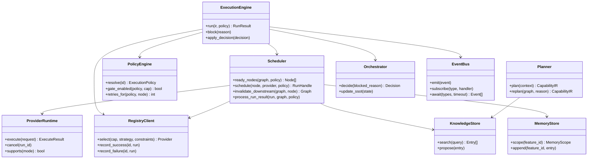

# Interfaces

**Normativo.** APIs internas — contratos entre componentes.

Relacionado: [runtime.md](runtime.md), [plugins.md](plugins.md)

---

## 1. Mapa de interfaces



---

## 2. ExecutionEngine

```typescript
interface ExecutionEngine {
  run(input: RunInput): Promise<RunResult>;
}

interface RunInput {
  ir: CapabilityIR;
  policy_id: string;
  feature_id: string;
  orchestrator_overrides?: Partial<ExecutionPolicy>;
}

interface RunResult {
  success: boolean;
  finished: boolean;
  blocked_reason?: string;
  metrics: FeatureMetrics;
  graph: GraphSnapshot;
}
```

---

## 3. Scheduler

```typescript
interface Scheduler {
  ready_nodes(graph: GraphStore, policy: ExecutionPolicy): Node[];
  schedule(node: Node, provider: Provider, policy: ExecutionPolicy): RunHandle;
  running(): RunHandle[];
  invalidate_downstream(graph: GraphStore, node: Node): GraphStore;
  process_run_result(run: RunResult, graph: GraphStore, policy: ExecutionPolicy): void;
}

interface RunHandle {
  run_id: string;
  node_id: string;
  provider_id: string;
  started_at: ISO8601;
  cancel(): void;
}
```

**Scheduler MUST NOT:**

- Mutate IR edges
- Choose policy
- Implement `Orchestrator.decide`

---

## 4. ProviderRuntime

```typescript
interface ProviderRuntime {
  execute(request: ExecuteRequest): Promise<ExecuteResult>;
  cancel(run_id: string): Promise<void>;
  supports(mode?: string): boolean;
  health(): HealthStatus;
}

interface ExecuteRequest {
  run_id: string;
  node_id: string;
  capability: CapabilityId;
  mode?: string;
  inputs: ResolvedInput[];
  definition_of_done: DoDCheck[];
  policy: { retries_remaining: number };
  memory: MemoryScope;
  knowledge_hits: KnowledgeEntry[];
  briefing: string;
}

interface ExecuteResult {
  run_id: string;
  success: boolean;
  evidence?: Evidence;
  error?: { code: string; message: string };
  contextual_learnings?: MemoryEntry[];
  durable_learnings?: ProposedKnowledgeEntry[];
  duration_ms: number;
}
```

---

## 5. Planner

```typescript
interface Planner {
  plan(context: PlanContext): CapabilityIR;
  replan(graph: GraphSnapshot, reason: string): CapabilityIR;
}

interface PlanContext {
  feature_request: string;
  upstream_artifacts: ArtifactRef[];  // spec, PRD, ADR
  knowledge: KnowledgeEntry[];
  memory?: MemoryScope;
}
```

**Planner MUST NOT:**

- Assign providers
- Set node status
- Define retries or policy

---

## 6. Orchestrator

```typescript
interface Orchestrator {
  decide(context: DecideContext): Decision;
  update_ssot(update: SSOTUpdate): void;
}

type Decision = "continuar" | "corrigir" | "replan";

interface DecideContext {
  blocked_reason: string;
  event_log: Event[];
  graph: GraphSnapshot;
  memory: MemoryScope;
  ssot: SSOTState;
}
```

---

## 7. RegistryClient

```typescript
interface RegistryClient {
  select(input: SelectInput): Provider;
  record_success(provider_id: string, run: ExecuteResult): void;
  record_failure(provider_id: string, run: ExecuteResult): void;
  get_capability(id: CapabilityId): CapabilityEntry;
}

interface SelectInput {
  capability: CapabilityId;
  strategy: ProviderStrategy;
  constraints?: Constraints;
  node?: Node;
}

type ProviderStrategy =
  | "stable"
  | "highest_quality"
  | "fastest"
  | "cheapest"
  | "experimental"
  | "priority";
```

---

## 8. EventBus

```typescript
interface EventBus {
  emit(event: Event): void;
  subscribe(type: EventType, handler: EventHandler): Unsubscribe;
  await(types: EventType[], filter?: EventFilter, timeout?: Duration): Promise<Event[]>;
}
```

---

## 9. GraphStore

```typescript
interface GraphStore {
  get_node(id: string): Node;
  set_node_status(id: string, status: NodeStatus): void;
  dependencies_satisfied(node: Node): boolean;
  transitive_dependents(node: Node): Node[];
  is_finished(): boolean;
  has_running(): boolean;
  has_failed_without_retry(policy: ExecutionPolicy): boolean;
  snapshot(): GraphSnapshot;
}
```

---

## 10. CapabilityInterface (Provider implements)

```typescript
interface CapabilityInterface {
  id: CapabilityId;
  contract: ContractRef;
  type: "worker" | "gate";
  inputs: InputSpec[];
  outputs: OutputSpec[];
  dod_schema: SchemaRef;
}
```

Provider manifest declara quais CapabilityInterfaces implementa.

---

## 11. Versionamento de interfaces

| Interface package | Version |
|-------------------|---------|
| `capability-orchestrator/engine` | 2.0.0 |
| Breaking change em ExecuteRequest | MAJOR bump |

Implementações MUST declarar compatibilidade no `provider.yaml`.
