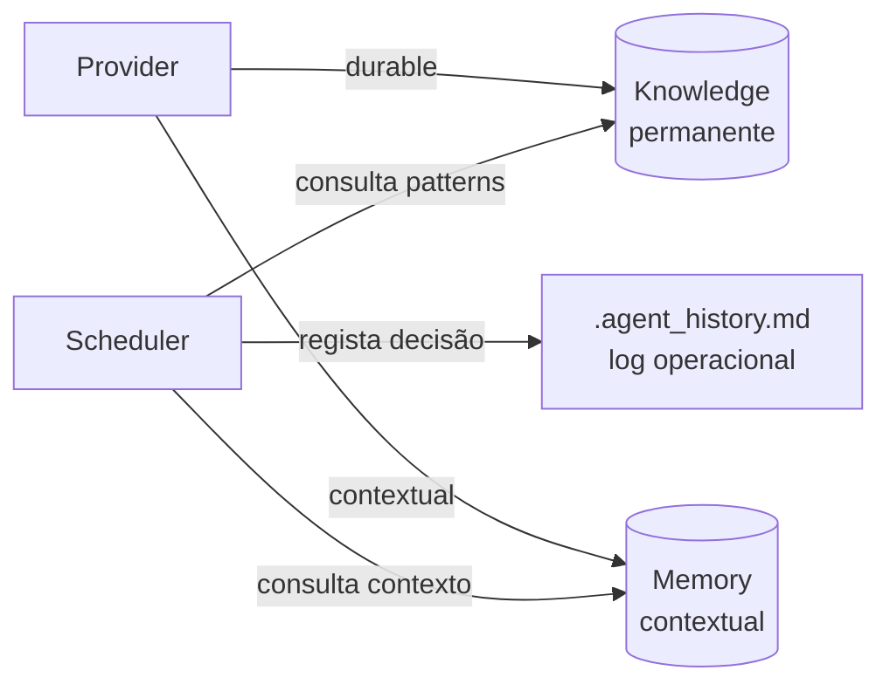

# Knowledge & Memory

**Normativo.** Dois níveis distintos — permanente vs contextual.

Relacionado: [runtime.md](runtime.md), [events.md](events.md)

---

## 1. Distinção fundamental

| | **Knowledge** | **Memory** |
|--|---------------|------------|
| **Natureza** | Permanente, reutilizável | Contextual, episódica |
| **Scope** | Projecto / org | Feature / sessão |
| **Exemplo** | "JWT funciona melhor neste projecto" | "Na feature Login o utilizador pediu botão azul" |
| **Consulta** | Antes de decisões técnicas | Durante execução da feature |
| **Escrita** | Curada, validada | Append automático |
| **Path** | `knowledge/` | `memory/<feature_id>/` |
| **Eventos** | `KnowledgeHit`, `KnowledgeProposed` | `MemoryWritten` |



---

## 2. Knowledge Base

### Estrutura

```
knowledge/
├── index.yaml                 # índice searchable
├── architecture/
│   └── boundaries.md
├── decisions/
│   └── ADR-0042-jwt-vs-session.md
├── patterns/
│   └── contract-first-parallel-be-fe.md
├── pitfalls/
│   └── sequential-user-id-in-urls.md
├── bugs/
│   └── auth-token-race-setup.md
├── contracts/
│   └── login-api-v1.md
└── learned-lessons/
    └── po-rejects-missing-error-states.md
```

### Entry schema

```yaml
# knowledge/patterns/contract-first-parallel-be-fe.md
---
id: pattern-contract-first
kind: pattern                           # pattern | pitfall | bug | decision | lesson | contract
capability: [api-contract, backend-implementation, frontend-ui]
tags: [parallelism, contracts]
confidence: 0.95                        # 0.0–1.0
source:
  features: ["2026-06-15-checkout", "2026-06-30-login"]
  events: ["KnowledgeProposed:..."]
created_at: 2026-06-15
updated_at: 2026-06-30
verified: true                          # curadoria humana ou auto após N hits
---

Após nó `api-contract` satisfied, BE e FE podem executar em paralelo.
Reduz tempo médio em 40% vs sequencial.
```

### Consulta

```python
def consult_knowledge(query: KnowledgeQuery) -> KnowledgeResult:
    # query: capability, tags, full-text, pitfall check
    entries = index.search(query)
    emit(KnowledgeHit, hits=entries, prevented_failure=...)
    return entries
```

**Quando consultar** (via ExecutionPolicy):

- Antes de `schedule` — pitfalls da capability
- Antes de `select provider` — patterns de stack
- Antes de `replan` — lessons similares

---

## 3. Memory (contextual)

### Estrutura

```
memory/
└── 2026-06-30-login-dashboard/
    ├── context.yaml           # metadata feature
    ├── preferences.yaml       # pedidos utilizador
    ├── decisions.yaml         # micro-decisões da feature
    └── artifacts-index.yaml   # refs rápidas
```

### context.yaml

```yaml
feature_id: "2026-06-30-login-dashboard"
ir_id: "2026-06-30-login-dashboard"
started_at: "2026-06-30T10:00:00Z"
policy: high-reliability
user_request: "Feature login + dashboard"
```

### preferences.yaml

```yaml
entries:
  - timestamp: "2026-06-30T10:05:00Z"
    source: user
    type: preference
    content: "Botão login deve ser azul (#2563EB)"
  - timestamp: "2026-06-30T11:00:00Z"
    source: po-review
    type: rejection_feedback
    content: "Empty state ausente no dashboard"
```

### decisions.yaml

```yaml
entries:
  - timestamp: "2026-06-30T10:20:00Z"
    node_id: be-auth
    decision: "Usar refresh token rotation"
    rationale: "ADR-0042 + security policy"
```

---

## 4. Fluxo de escrita

| Origem | Destino | Mecanismo |
|--------|---------|-----------|
| Provider `durable_learnings` | Knowledge (proposed) | `KnowledgeProposed` → curadoria |
| Provider `contextual_learnings` | Memory | `MemoryWritten` automático |
| Orchestrator decision | Memory + `.agent_history.md` | SSOT |
| PO rejection | Memory + Knowledge (lesson) | Gate event |
| Pattern confirmado 3× | Knowledge (verified) | Telemetry rule |

### Promoção Memory → Knowledge

```yaml
# Regra automática (configurável)
promotion:
  min_occurrences: 3
  min_features: 2
  kinds: [lesson, preference-generalized]
```

Ex.: "Botão azul" em 1 feature → Memory. "Sempre usar feedback inline em forms" após 3 PO rejections → Knowledge.

---

## 5. `.agent_history.md` — terceiro nível

| | Knowledge | Memory | agent_history |
|--|-----------|--------|---------------|
| Propósito | Saber reutilizável | Contexto feature | Log operacional |
| Audiência | Scheduler, Planner | Workers, Orchestrator | Reidratação chat |
| Formato | Curado YAML/MD | YAML estruturado | Append MD livre |

**Não confundir** nenhum dos três.

---

## 6. API

```yaml
KnowledgeStore:
  search(query: KnowledgeQuery) -> Entry[]
  propose(entry: ProposedEntry) -> void
  verify(entry_id) -> void

MemoryStore:
  scope(feature_id) -> MemoryScope
  append(feature_id, entry: MemoryEntry) -> void
  get_preferences(feature_id) -> Entry[]
  get_decisions(feature_id) -> Entry[]
```

---

## 7. Privacy & scope

| Dado | Scope | Retenção |
|------|-------|----------|
| User preference "botão azul" | Memory | Até feature complete + 90d |
| JWT pattern | Knowledge | Permanente |
| PO rejection pattern | Knowledge | Permanente após verificação |
| Credentials | **Nunca** KB/Memory | — |
