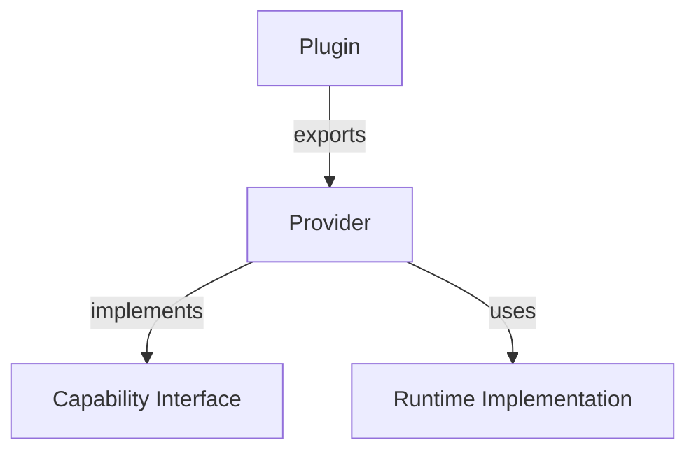

# Plugins

**Normativo.** Formaliza Provider como plugin exportável.

Relacionado: [provider-manifest.md](provider-manifest.md), [interfaces.md](interfaces.md)

---

## 1. Modelo

```
Plugin
  ├── exports Provider(s)
  ├── implements CapabilityInterface (via manifest)
  └── registers via provider.yaml
```

| Conceito | Relação |
|----------|---------|
| **Capability** | Interface semântica (o quê) |
| **Provider** | Implementação registada |
| **Plugin** | Pacote que exporta ≥1 Provider |



---

## 2. Tipos de Plugin

| `plugin.type` | Implementação | Exemplo |
|---------------|---------------|---------|
| `cursor-skill` | `SKILL.md` + subagent | `frontend-pro`, `backend` |
| `mcp` | MCP Server + tools | Puppeteer, Firecrawl |
| `shell` | Comando / script | `npm test`, `pytest` |
| `human` | Human-in-the-loop | grilling, PO manual |
| `remote-agent` | API externa | OpenAI Assistants, Cursor Cloud |
| `browser` | Browser automation | agent-browser |
| `docker` | Container isolado | CI repro, sandbox |

**Todos iguais perante o Scheduler** — mesma interface `ProviderRuntime`.

---

## 3. Plugin Interface

```yaml
# Conceptual — ver interfaces.md
Plugin:
  load(manifest: ProviderManifest) -> PluginInstance
  capabilities() -> CapabilityId[]
  health() -> HealthStatus

ProviderRuntime:
  execute(request: ExecuteRequest) -> ExecuteResult
  cancel(run_id) -> void
  supports(mode: string) -> bool
```

### ExecuteRequest

```yaml
run_id: "uuid"
node_id: fe-login
capability: frontend-ui
mode: build
inputs:
  - ref: contract-1.outputs
    resolved_path: "docs/contracts/login-api.md"
definition_of_done: [...]
policy: { retries_remaining: 2 }
memory_scope: "2026-06-30-login-dashboard"
briefing: "Briefing Relâmpago..."
```

### ExecuteResult

```yaml
run_id: "uuid"
success: true
evidence: { ... }              # ver evidence.md
contextual_learnings: []       # → Memory
durable_learnings: []          # → Knowledge (proposed)
duration_ms: 720000
provider_id: frontend-pro
```

---

## 4. Registo de Plugin

```yaml
# plugins/registry.yaml (opcional — índice de plugins)
plugins:
  - name: cursor-skill-frontend-pro
    path: providers/frontend-pro/
    types: [cursor-skill]
    enabled: true

  - name: mcp-puppeteer
    path: plugins/mcp/puppeteer/
    types: [mcp, browser]
    enabled: true

  - name: shell-npm-test
    path: plugins/shell/npm-test/
    types: [shell]
    enabled: true
```

---

## 5. Plugin Loader

```python
def load_plugin(manifest: ProviderManifest) -> ProviderRuntime:
    match manifest.spec.plugin.type:
        case "cursor-skill":
            return CursorSkillPlugin(manifest.entrypoint)
        case "mcp":
            return MCPPlugin(manifest.mcp_server)
        case "shell":
            return ShellPlugin(manifest.command)
        case "human":
            return HumanPlugin(manifest.prompt_template)
        case "remote-agent":
            return RemoteAgentPlugin(manifest.endpoint)
        case "browser":
            return BrowserPlugin(manifest.browser_config)
        case "docker":
            return DockerPlugin(manifest.image)
```

---

## 6. Composição de Plugins

Provider pode delegar a outro plugin:

```yaml
# frontend-pro provider.yaml
spec:
  capabilities:
    - id: frontend-ui
      modes:
        - name: vision
          delegates:
            plugin: image-to-code
            capability: visual-generation
```

Scheduler vê **um** provider; runtime resolve delegação internamente.

---

## 7. Extensibilidade

Adicionar novo tipo de plugin:

1. Implementar `ProviderRuntime`
2. Registar no Plugin Loader
3. Documentar `plugin.type` em [provider-manifest.md](provider-manifest.md)
4. Zero alteração no Scheduler loop

---

## 8. Exemplos futuros

| Plugin | Capabilities |
|--------|--------------|
| Plugin OpenAI | `llm-generation`, `code-review` |
| Plugin Claude | idem |
| Plugin MCP | `browser-automation`, `web-scrape` |
| Plugin Human | `design-stress-test`, `po-acceptance-manual` |
| Plugin Docker | `isolated-test`, `repro-env` |

Todos exportam `provider.yaml` — ecossistema uniforme.
