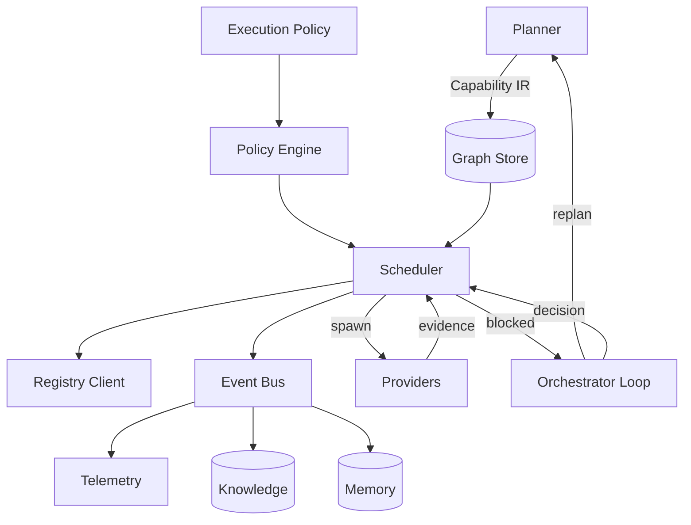
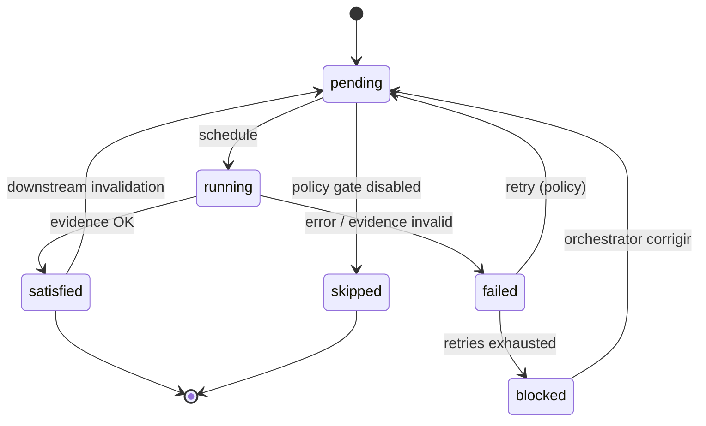

# Runtime — Execution Engine

**Normativo.** Define o algoritmo exacto do loop de execução.

Relacionado: [capability-ir.md](capability-ir.md), [execution-policies.md](execution-policies.md), [events.md](events.md), [interfaces.md](interfaces.md)

---

## 1. Visão

O **Execution Engine** é o runtime interno do Orquestrador. Composto por:

| Subsistema | Papel |
|------------|-------|
| **Graph Store** | Estado mutável do DAG (nós, arestas, status) |
| **Scheduler** | Executa políticas sobre o grafo — **não** decide comportamento global |
| **Event Bus** | Comunicação dirigida por eventos |
| **Policy Engine** | Resolve `ExecutionPolicy` activa |
| **Registry Client** | Consulta Capability Registry (com estratégia) |
| **Orchestrator Loop** | SSOT, escalada, `continuar \| corrigir \| replanejar` |



---

## 2. Pré-condições

Antes de `engine.run()`:

1. `Capability IR` validado ([capability-ir.md](capability-ir.md))
2. `ExecutionPolicy` resolvida ([execution-policies.md](execution-policies.md))
3. Registry carregado ([registry.md](registry.md))
4. `feature_id` e `memory/` scope criados ([knowledge-memory.md](knowledge-memory.md))

---

## 3. Estado do Engine

```yaml
engine_state:
  feature_id: "2026-06-30-login-dashboard"
  ir_version: "2.0.0"
  policy_id: "high-reliability"
  phase_gate: 2                    # gate de alto nível SSOT
  graph: GraphStore                  # mutável
  event_log: []                      # append-only
  orchestrator_decision: null        # continuar | corrigir | replanejar
  blocked_reason: null
  finished: false
  metrics: MetricsAccumulator
```

---

## 4. Algoritmo principal

### Pseudocódigo

```python
def run(engine: ExecutionEngine) -> RunResult:
    graph = engine.load_ir(engine.ir)
    policy = engine.policy_engine.resolve(engine.policy_id)
    engine.emit(FeatureStarted, feature_id=engine.feature_id)

    while not graph.is_finished():

        # ── 1. Escalada humana / SSOT ──
        if engine.orchestrator_decision == "replan":
            ir = engine.planner.replan(engine.graph, engine.blocked_reason)
            graph = engine.load_ir(ir)
            engine.orchestrator_decision = None
            engine.emit(PlannerReplan, ir_version=ir.version)
            continue

        if engine.orchestrator_decision == "corrigir":
            graph = engine.scheduler.invalidate_failed_subgraph(graph)
            engine.orchestrator_decision = None
            engine.emit(SubgraphInvalidated, node_ids=graph.invalidated)
            continue

        if engine.blocked_reason is not None:
            decision = engine.orchestrator.decide(engine.blocked_reason)
            engine.apply_orchestrator_decision(decision)
            continue

        # ── 2. Nós prontos ──
        ready = engine.scheduler.ready_nodes(graph, policy)

        if not ready:
            if graph.has_running():
                engine.wait(timeout=policy.wait_timeout)
                engine.process_completed_runs()
                continue
            if graph.has_failed_without_retry(policy):
                engine.block("unrecoverable_failure")
                continue
            engine.block("deadlock_or_waiting_external")
            continue

        # ── 3. Agendar (paralelo até policy.max_parallel) ──
        batch = ready[: policy.max_parallel]
        for node in batch:
            provider = engine.registry.select(
                capability=node.capability,
                strategy=policy.provider_strategy,
                constraints=node.constraints,
            )
            engine.emit(ProviderSelected, node_id=node.id, provider_id=provider.id)
            engine.scheduler.schedule(node, provider, policy)

        # ── 4. Esperar conclusões ──
        completed = engine.wait_for_any(
            timeout=policy.step_timeout,
            running=engine.scheduler.running(),
        )

        for run in completed:
            engine.process_run_result(run, graph, policy)

    engine.emit(FeatureCompleted, metrics=engine.metrics.snapshot())
    return RunResult(success=True, metrics=engine.metrics)
```

### Invariantes

| ID | Invariante |
|----|------------|
| I1 | Um nó `satisfied` só transita se `evidence` valida contra DoD |
| I2 | Gates **nunca** transicionam para `satisfied` sem `verdict` |
| I3 | Scheduler **nunca** altera arestas do IR — só status e metadata |
| I4 | `replan` só via Orchestrator → Planner |
| I5 | Todo evento emitido é append-only no event log |

---

## 5. `ready_nodes(graph, policy)`

```python
def ready_nodes(graph, policy) -> list[Node]:
    candidates = []
    for node in graph.nodes:
        if node.status != "pending":
            continue
        if not graph.dependencies_satisfied(node):
            continue
        if node.type == "gate" and not policy.gate_enabled(node.capability):
            node.status = "skipped"
            emit(GateSkipped, node_id=node.id)
            continue
        if node.capability_version_incompatible(node):
            block("contract_version_mismatch")
            continue
        candidates.append(node)

    return order_for_execution(candidates, policy.execution_order)
```

**`execution_order`:** `topological` (default) | `priority_field` | `capability_weight`

---

## 6. `process_run_result(run, graph, policy)`

```python
def process_run_result(run, graph, policy):
    node = graph.get(run.node_id)
    engine.emit(NodeCompleted if run.success else NodeFailed, ...)

    if run.knowledge_hits:
        engine.emit(KnowledgeHit, hits=run.knowledge_hits)

    if not run.success:
        node.retry_count += 1
        if node.retry_count <= policy.retries_for(node):
            node.status = "pending"
            engine.emit(RetryScheduled, node_id=node.id, attempt=node.retry_count)
            engine.registry.record_failure(run.provider_id, run)
            return
        node.status = "failed"
        engine.registry.record_failure(run.provider_id, run)
        if node.type == "gate":
            engine.invalidate_downstream(node)
        engine.block(run.failure_reason)
        return

    # Validar evidence
    if not validate_evidence(run.evidence, node.definition_of_done):
        treat_as_failure(run, reason="evidence_incomplete")
        return

    node.status = "satisfied"
    node.evidence = run.evidence
    engine.registry.record_success(run.provider_id, run)
    engine.memory.append(run.contextual_learnings)
    engine.knowledge.propose(run.durable_learnings)  # curadoria async

    if node.type == "gate":
        verdict = run.evidence.verdict
        if verdict == "rejected":
            engine.emit(GateRejected, node_id=node.id)
            engine.invalidate_downstream(node)
            if policy.on_gate_reject == "orchestrator":
                engine.block("gate_rejected")
            return
        engine.emit(GatePassed, node_id=node.id)

    engine.update_phase_gate(node)
```

---

## 7. Invalidação parcial

```python
def invalidate_downstream(graph, failed_node):
    affected = graph.transitive_dependents(failed_node)
    for node in affected:
        if node.status in ("satisfied", "running", "pending"):
            node.status = "pending"
            node.evidence = None
            node.retry_count = 0  # policy pode override
    emit(SubgraphInvalidated, root=failed_node.id, affected=affected)
```

**Não invalida** ancestrais satisfied — apenas descendentes.

---

## 8. `wait()` e concorrência

| Modo | Comportamento |
|------|---------------|
| `async` | Múltiplos providers em paralelo até `max_parallel` |
| `sync` | Um nó por vez (`rapid-prototype` policy) |
| `gate_barrier` | Todos workers de um "stage" satisfied antes de gates do stage |

```python
def wait_for_any(timeout, running):
    # Subagentes Cursor, MCP, human-in-loop, shell
    return event_bus.await(
        types=[NodeCompleted, NodeFailed, HumanInputReceived],
        timeout=timeout,
        filter=lambda e: e.run_id in running,
    )
```

---

## 9. Integração Orchestrator

O Orchestrator **não** está dentro do loop de scheduling. Intervém quando:

| Trigger | Acção |
|---------|-------|
| `engine.blocked` | `decide() → continuar \| corrigir \| replanejar` |
| Fase gate atingida | SSOT update, `.agent_history.md` |
| Falha catastrófica infra | Pausa, registo, `finished=true` |

```python
def orchestrator.decide(blocked_reason) -> Decision:
    # Lê SSOT, memory, knowledge, event_log recente
    if blocked_reason == "gate_rejected" and minor_adjustments:
        return Decision("corrigir")
    if blocked_reason == "contract_version_mismatch":
        return Decision("replan")
    if blocked_reason == "unrecoverable_failure":
        return Decision("replan")  # ou escala humano
    return Decision("continuar")   # retry implícito via invalidação
```

---

## 10. Ciclo de vida de um nó (máquina de estados)



---

## 11. Terminação

`graph.is_finished()` quando:

- Todos os nós estão em `satisfied | skipped`, **ou**
- Orchestrator define `finished=true` com bloqueio documentado, **ou**
- Policy `fail_fast=true` e primeiro `failed` irrecuperável

---

## 12. Exemplo trace (login feature)

```
FeatureStarted
ProviderSelected node=contract-1 provider=planner
NodeCompleted node=contract-1
ProviderSelected node=be-auth provider=backend
ProviderSelected node=fe-login provider=frontend-pro
NodeCompleted node=be-auth
NodeCompleted node=fe-login
ProviderSelected node=fe-review provider=frontend-pro mode=review
GatePassed node=fe-review
ProviderSelected node=test-suite provider=testing
NodeFailed node=test-suite
RetryScheduled node=test-suite attempt=1
NodeFailed node=test-suite
SubgraphInvalidated root=test-suite
ProviderSelected node=be-auth provider=backend  # corrigir
NodeCompleted node=be-auth
GatePassed node=test-suite
FeatureCompleted
```

---

## 13. Implementação mínima (MVP)

Ordem sugerida para codificar:

1. Graph Store + IR loader
2. Event Bus in-process (lista append-only)
3. `ready_nodes` + `schedule` síncrono (sem paralelo)
4. Evidence validation básica
5. Invalidação downstream
6. Orchestrator hook em `blocked`
7. Paralelismo + Registry strategies
8. Knowledge/Memory clients
