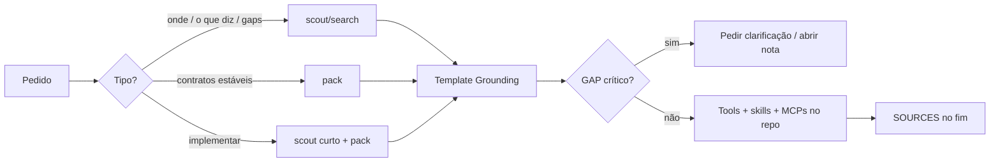

# Ritual scout → implement → validar

## Propósito

Separar **descoberta na wiki** de **edição no código**, para o Agent não inventar contratos Gaab.

## Fluxo

## Regras do ritual

1. **Clarificar** se faltar projeto/tópico — não scout amplo com near-misses.
2. **Pack → scout** quando o domínio é conhecido (KernelBot RAG, OrbitBot↔Kernel).
3. **Implement** só com CONSTRAINTS do grounding (ou GAP explícito); nunca via `wiki vibe`.
4. **Validar**: se o código contradisser a wiki, preferir a wiki e assinalar desvio.
5. Sempre preencher **Método** + **Handoff** no template.

## Anti-padrões

- Chamar `wiki vibe` / Composer CLI para substituir o Agent Cursor.
- Inventar endpoints “óbvios” sem fonte.
- Colar dezenas de chunks no chat — 3–8 fontes + pack bastam.
