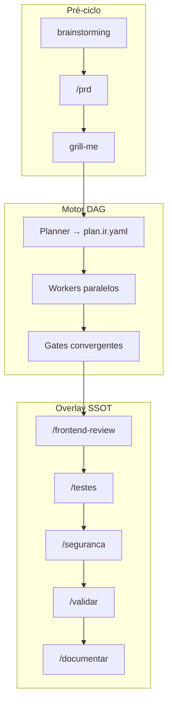

# MegaBrain — Guia Completo do Ecossistema AGENTS

**Versão do documento:** 2026-07-02  
**Audiência:** qualquer pessoa que entre no projeto pela primeira vez — dev, PO, ou contribuidor de skills  
**Governança:** [ARCHITECTURAL-PRINCIPLES.md](../.cursor/skills/orquestrar/references/ARCHITECTURAL-PRINCIPLES.md)  
**Contratos runtime v2.1:** [contracts/README.md](../.cursor/skills/orquestrar/references/contracts/README.md)

> Este documento explica **tudo** num só sítio: o que é o projeto, como usar, cada skill, cada agente, cada comando, cada fase e como o motor TypeScript se liga ao Cursor. Para alterações ao pipeline, actualizar primeiro `orquestrar/SKILL.md` e `ecosystem-v2.md`, depois este ficheiro.

---

## Índice

### Parte I — Começar do zero

1. [Para quem é este documento](#1-para-quem-é-este-documento)
2. [O repositório AGENTS em cinco minutos](#2-o-repositório-agents-em-cinco-minutos)
3. [O problema que o MegaBrain resolve](#3-o-problema-que-o-megabrain-resolve)
4. [Glossário essencial](#4-glossário-essencial)
5. [Estrutura física do projeto](#5-estrutura-física-do-projeto)
6. [Skill, Agent e Comando — três camadas diferentes](#6-skill-agent-e-comando--três-camadas-diferentes)

### Parte II — Arquitectura e conceitos

7. [Paradigma v2: Capability → Provider → Skill](#7-paradigma-v2-capability--provider--skill)
8. [Workers, Gates, Upstream e Meta](#8-workers-gates-upstream-e-meta)
9. [Componentes do runtime](#9-componentes-do-runtime)
10. [Runtime Cursor vs Execution Engine TypeScript](#10-runtime-cursor-vs-execution-engine-typescript)

### Parte III — Como usar no dia-a-dia

11. [Primeiro uso — setup mínimo](#11-primeiro-uso--setup-mínimo)
12. [Como invocar `/MegaBrain`](#12-como-invocar-megabrain)
13. [Fluxos de uso ideais (3 cenários)](#13-fluxos-de-uso-ideais-3-cenários)
14. [O ciclo de fases — visão geral](#14-o-ciclo-de-fases--visão-geral)
15. [Cada fase explicada individualmente](#15-cada-fase-explicada-individualmente)

### Parte IV — Coordenação e regras

16. [Protocolo PDA (delegação entre agentes)](#16-protocolo-pda-delegação-entre-agentes)
17. [SSOT — fonte única de verdade](#17-ssot--fonte-única-de-verdade)
18. [Matriz de decisão: continuar | corrigir | replanejar](#18-matriz-de-decisão-continuar--corrigir--replanejar)
19. [HARD-GATES globais](#19-hard-gates-globais)
20. [Memória e persistência](#20-memória-e-persistência)
21. [Evidence v2.1 — provas obrigatórias](#21-evidence-v21--provas-obrigatórias)

### Parte V — Catálogo completo

22. [Mapa de comandos `/`](#22-mapa-de-comandos-)
23. [Cada comando explicado individualmente](#23-cada-comando-explicado-individualmente)
24. [Skills Tier 1 — pipeline principal (uma a uma)](#24-skills-tier-1--pipeline-principal-uma-a-uma)
25. [Skills Tier 2 — condicionais (uma a uma)](#25-skills-tier-2--condicionais-uma-a-uma)
26. [Skills globais Tier 3](#26-skills-globais-tier-3)
27. [Meta-skill: skill-authoring](#27-meta-skill-skill-authoring)
28. [Agents espelho — um a um](#28-agents-espelho--um-a-um)

### Parte VI — Motor TypeScript

29. [Execution Engine — do zero](#29-execution-engine--do-zero)
30. [Job pickup e retomada automática](#30-job-pickup-e-retomada-automática)

### Parte VII — Fecho

31. [Exemplo ponta-a-ponta completo](#31-exemplo-ponta-a-ponta-completo)
32. [Anti-patterns e limites](#32-anti-patterns-e-limites)
33. [Referências e manutenção](#33-referências-e-manutenção)

---

# Parte I — Começar do zero

## 1. Para quem é este documento

Imagina que acabaste de entrar no repositório **CursorSKILLS** (export do ecossistema MegaBrain) e ouviste falar do **MegaBrain**. Este ficheiro responde, sem assumir contexto prévio:

- O que é o ecossistema e para que serve
- Como adicionar uma feature num projeto real
- O que faz cada skill, cada agente e cada comando `/`
- Como o código TypeScript em `Cursor/orchestrator/` se relaciona com o chat do Cursor
- Quais regras são invioláveis (gates, evidência, isolamento do PO)

**Não precisas de ler tudo de uma vez.** Usa o índice: secções 1–13 para começar a trabalhar; secções 24–28 como enciclopédia de referência.

---

## 2. O repositório AGENTS em cinco minutos

O repositório **CursorSKILLS** (export do ecossistema MegaBrain) é um **ecossistema de agentes especializados** para desenvolvimento de software no **Cursor IDE**. Em vez de um único prompt genérico, o trabalho divide-se em:

| Peça | O que é | Onde vive |
|------|---------|-----------|
| **MegaBrain** | Orquestrador raiz — mantém estado, delega, valida gates | `.cursor/skills/orquestrar/` |
| **Skills** | Instruções normativas por especialidade (backend, testes, PO…) | `.cursor/skills/<nome>/SKILL.md` |
| **Agents** | Atalhos Markdown para humanos (resumos, não contratos) | `Cursor/Agents/*.md` |
| **Comandos `/`** | Atalhos no chat do Cursor | `.cursor/commands/*.md` |
| **Execution Engine** | Motor TypeScript que executa grafos (DAG) com evidência | `Cursor/orchestrator/` |

**Filosofia central:** crescer por **capabilities** (unidades de trabalho semânticas) e **contratos** (interfaces estáveis), não por dezenas de micro-skills soltas. Variantes de comportamento são **modos** dentro do mesmo provider (ex.: `frontend-pro` em Build vs Review).

---

## 3. O problema que o MegaBrain resolve

Sem orquestração, um agente de IA tende a:

- Implementar código sem requisitos documentados
- Saltar testes, segurança ou aceite de produto
- Perder contexto entre sessões de chat
- Misturar papéis (quem implementa também “aprova”)
- Avançar sem provas observáveis

O **MegaBrain** impõe um **ciclo fechado**:

```text
Requisitos → Plano (DAG) → Implementação → Gates com evidência → Decisão → Documentação
```

Cada avanço exige **evidência**. Cada falha entra num loop **`corrigir`** ou **`replanejar`**. O estado persiste em `.agent_history.md` para sobreviver a novos chats.

---

## 4. Glossário essencial

| Termo | Significado |
|-------|-------------|
| **MegaBrain** | Nome comercial do orquestrador; comando `/MegaBrain` |
| **orquestrar** | Nome interno da skill raiz (`orchestration`) |
| **Capability** | *O quê* precisa de ser feito (ex.: `backend-implementation`) |
| **Provider** | *Quem* implementa a capability (ex.: skill `backend`) |
| **Skill** | Ficheiro `SKILL.md` com instruções para o agente Cursor |
| **Worker** | Provider que **produz** artefactos (código, schema, pipeline) |
| **Gate** | Provider que **valida** com evidência; pode bloquear o ciclo |
| **PDA** | Protocolo de Delegação Autónoma — quando e como usar subagentes |
| **SSOT** | Single Source of Truth — estado global mantido pelo orquestrador |
| **DAG** | Grafo acíclico dirigido — motor real de execução (dependências entre tarefas) |
| **Capability IR** | Ficheiro YAML (`plan.ir.yaml`) com o grafo formal para o engine |
| **Evidence** | Prova estruturada (JSON) de que um nó ou gate concluiu correctamente |
| **Job pickup** | Mecanismo em que o engine escreve um job e o agente Cursor completa offline |

---

## 5. Estrutura física do projeto

```text
AGENTS/
└── Cursor/
    ├── docs/
    │   └── MegaBrain-Ecosystem.md          ← este documento
    ├── Agents/                              ← atalhos humanos (8 ficheiros)
    │   ├── Orquestrador-v2.md
    │   ├── Prd.md, Planner.md, backend.md …
    ├── orchestrator/                        ← Execution Engine TypeScript
    │   ├── src/engine/, scheduler/, registry/ …
    │   ├── providers/*/provider.yaml
    │   ├── jobs/                            ← job pickup + checkpoints
    │   └── tests/
    └── .cursor/
        ├── commands/                        ← atalhos / no chat (9 comandos)
        └── skills/                          ← contratos normativos (13 skills)
            ├── orquestrar/SKILL.md          ← raiz MegaBrain
            ├── planner/, backend/, testing/ …
            └── orquestrar/references/
                ├── ARCHITECTURAL-PRINCIPLES.md
                ├── contracts/               ← contratos runtime v2.1
                └── specs/                   ← specs de implementação
```

**Skills globais** (instaladas no utilizador, não no repo):

```text
~/.agents/skills/          ← image-to-code, brainstorming, grill-me, find-skills …
~/.cursor/agents.env       ← AGENTS_ROOT, ORCHESTRATOR_ROOT
```

---

## 6. Skill, Agent e Comando — três camadas diferentes

| Camada | Ficheiro | Quem lê | Função |
|--------|----------|---------|--------|
| **Skill** | `.cursor/skills/<nome>/SKILL.md` | Agente Cursor | Contrato **normativo** — o que fazer, como, vereditos, limites |
| **Agent** | `Cursor/Agents/<Nome>.md` | Humano (e por vezes agente) | **Resumo executivo** — atalho de leitura, não substitui SKILL |
| **Comando** | `.cursor/commands/<nome>.md` | Cursor ao digitar `/` | **Gatilho** — aponta para a skill e variáveis de ambiente |

**Regra de ouro:** em caso de conflito, **`SKILL.md` ganha sempre**. Agents podem estar desactualizados (ex.: `Security.md` vs `security` v2.1).

**Exemplo:**

```text
Utilizador digita:  /MegaBrain — adicionar exportação CSV
Cursor carrega:     .cursor/commands/MegaBrain.md
Agente executa:     .cursor/skills/orquestrar/SKILL.md
Humano consulta:    Cursor/Agents/Orquestrador-v2.md (opcional)
```

---

# Parte II — Arquitectura e conceitos

## 7. Paradigma v2: Capability → Provider → Skill

Três níveis de abstracção:

```text
Capability: frontend-ui          ← O QUÊ (semântica)
    ↓ Registry resolve
Provider: frontend-pro           ← QUEM (entidade registada)
    ↓ Implementação
Skill: .cursor/skills/frontend-pro/SKILL.md   ← COMO (instruções Cursor)
```

**Porquê separar?**

- O **Planner** define *o quê* (grafo de capabilities) — **nunca** escolhe provider
- O **Registry** escolhe *quem* com base em política, score, compatibilidade
- A **Skill** diz ao agente Cursor *como* executar na prática

Exemplos de capabilities:

| Capability | Provider típico |
|------------|---------------|
| `planning` | `planner` |
| `backend-implementation` | `backend` |
| `frontend-ui` | `frontend-pro` |
| `testing` | `testing` |
| `security-review` | `security` |
| `po-acceptance` | `po-review` |
| `business-requirements` | `prd` |

---

## 8. Workers, Gates, Upstream e Meta

| Tipo | Papel | Avança o ciclo? | Exemplos |
|------|-------|-----------------|----------|
| **Worker** | Produz artefactos | Sim, após entrega | `backend`, `frontend-pro`, `database`, `devops` |
| **Gate** | Valida com evidência; pode bloquear | Só com veredito positivo | `testing`, `security`, `po-review`, `documentation` |
| **Upstream** | Documentação **antes** do código | Prepara Fase 1+ | `prd`, `adr` |
| **Meta** | Cria/melhora outras skills | Fora do pipeline de feature | `skill-authoring` |
| **Raiz** | Orquestra tudo | Controla o ciclo inteiro | `orquestrar` (MegaBrain) |

**Regra inviolável:** gates **nunca** produzem código de produto; workers **nunca** emitem veredito final de aceite.

---

## 9. Componentes do runtime

```text
Utilizador → /MegaBrain (orquestrar)
                │
                ├── Planner → Capability IR (plan.ir.yaml) + Planner Evidence
                ├── Execution Policy → retries, gates, profundidade de custo
                ├── Scheduler (DAG) → ready → schedule → wait → validate
                ├── Registry → capability → provider + Selection Evidence
                ├── Executor → Provider (WHAT) + transporte (HOW)
                └── SSOT + PDA + .agent_history.md
```

| Componente | Responsável | Contrato |
|------------|-------------|----------|
| Orquestrador | SSOT, decisões estratégicas | `orquestrar/SKILL.md` |
| Planner | Task Graph — **não** escolhe providers | [contracts/planner.md](../.cursor/skills/orquestrar/references/contracts/planner.md) |
| Scheduler | Paralelismo DAG, ordem topológica | [contracts/scheduler.md](../.cursor/skills/orquestrar/references/contracts/scheduler.md) |
| Registry | Capability → Provider | [contracts/registry.md](../.cursor/skills/orquestrar/references/contracts/registry.md) |
| Evidence | Observabilidade universal | [contracts/evidence.md](../.cursor/skills/orquestrar/references/contracts/evidence.md) |
| Execution Engine | Ciclo de vida + state machine | [contracts/runtime.md](../.cursor/skills/orquestrar/references/contracts/runtime.md) |

As **fases 0.5–6** (PRD, planejar, testes, PO…) são **overlay SSOT** para humanos. O motor de execução real é sempre o **DAG** de dependências.

---

## 10. Runtime Cursor vs Execution Engine TypeScript

Dois modos de operação coexistem:

| Modo | Quando | Fluxo |
|------|--------|-------|
| **Engine** (preferido) | `ORCHESTRATOR_ROOT` definido | `plan.ir.yaml` → `run-engine` → job pickup → evidence → retoma |
| **PDA legado** | Engine indisponível | Subagentes por fase via SKILL.md no chat |

Na prática, **na maioria das sessões Cursor** o fluxo é PDA (delegação no chat). O engine TypeScript entra quando o orquestrador invoca `npm run run-engine` — útil para DAG formal, evidência estruturada e retomada após jobs externos.

---

# Parte III — Como usar no dia-a-dia

## 11. Primeiro uso — setup mínimo

### No repositório do teu projeto

1. Garantir que as skills AGENTS estão disponíveis (repo clonado ou skills copiadas para `.cursor/skills/`)
2. Opcional: configurar `~/.cursor/agents.env`:
   ```bash
   export AGENTS_ROOT=/caminho/para/AGENTS/Cursor
   export ORCHESTRATOR_ROOT=/caminho/para/AGENTS/Cursor/orchestrator
   ```
3. No chat do Cursor, usar `/MegaBrain` ou comandos de fase isolados

### O que o projeto passa a ter após uma feature

| Artefacto | Path típico |
|-----------|-------------|
| Log de decisões | `.agent_history.md` (raiz do projeto) |
| Documentação upstream | `docs/prd/`, `docs/API_SPEC.md`, etc. |
| Plano + IR | `memory/<feature_id>/plan.ir.yaml` |
| Evidência de gates | `telemetry/evidence/*.json` |
| Screenshots UI | `.frontend-review/<data>/` |

---

## 12. Como invocar `/MegaBrain`

### Sintaxe

```text
/MegaBrain — [descrição clara da feature ou pedido]

Contexto:
@docs/PRD.md
@outro-ficheiro.md

Objetivo: …
Restrições: …
Critério de fecho: …
```

Ficheiro de comando: `.cursor/commands/MegaBrain.md`  
Skill executada: `.cursor/skills/orquestrar/SKILL.md`

### O que acontece na invocação

1. O agente lê o contrato normativo `orquestrar/SKILL.md`
2. Reidrata `[ESTADO ATUAL]` a partir de `.agent_history.md` (se existir)
3. Avalia a fase correcta: Fase 0.5 (docs), Fase 1 (plano), ou continuação
4. Delega subagentes via **PDA** quando necessário
5. Corre o pipeline até `concluído`, `bloqueado`, ou ordem explícita para parar

### Invocação isolada de fases

Podes correr **só** `/planejar`, `/testes`, `/seguranca`, etc., sem o ciclo completo. Mas **apenas o MegaBrain** mantém SSOT e integra todas as fases com decisões `continuar | corrigir | replanejar`.

### Variáveis de ambiente

| Variável | Uso |
|----------|-----|
| `AGENTS_ROOT` | Raiz do ecossistema AGENTS |
| `ORCHESTRATOR_ROOT` | Runtime TypeScript `Cursor/orchestrator/` |

---

## 13. Fluxos de uso ideais (3 cenários)

### Cenário A — Feature nova com escopo real (recomendado)

```text
/MegaBrain — Adicionar exportação CSV de relatórios

Contexto:
@docs/notas-feature.md

Objetivo: usuário exporta relatório filtrado em CSV
Restrições: sem mudança de schema
Critério de fecho: testes verdes + PO OK
```

**O que o MegaBrain faz:**

```text
brainstorming? (opcional)
    → /prd (pacote docs/) → AGUARDA tua aprovação
    → /planejar (DAG + plan.ir.yaml)
    → Fase 2: backend ∥ frontend (se aplicável)
    → Fase 2.5: /frontend-review (se UI)
    → /testes → /seguranca → /validar → /documentar
```

**Tu só precisas de:** aprovar o pacote `docs/` quando pedido; o resto é autónomo (silêncio = consentimento para continuar).

### Cenário B — Incremento pequeno com docs já no repo

```text
/MegaBrain — Implementar secção 4.2 do @docs/PRD.md

Critérios de aceite: [lista curta]
Não alterar: [módulos fora de scope]
```

MegaBrain pode **encurtar** Fase 0.5 e ir directo para `/planejar` → execução.

### Cenário C — Tarefa pontual (sem ciclo completo)

**Não uses `/MegaBrain`.** Usa o comando da fase:

```text
/backend — endpoint POST /api/invoices conforme @API_SPEC.md
/testes — validar módulo billing
```

MegaBrain só faz sentido para **ciclo fechado com gates**.

### Quando usar `@documento`

| Situação | Acção |
|----------|-------|
| Já tens spec boa | Anexa com `@` — MegaBrain consome como input |
| Só tens ideia vaga | MegaBrain → brainstorming → `/prd` |
| Doc incompleto | MegaBrain pede clarificação ou propõe `/prd` |
| Mockup de UI | Anexa imagem → HARD-GATE `image-to-code` automático |

---

## 14. O ciclo de fases — visão geral



| Fase | Nome | Comando | Tipo |
|------|------|---------|------|
| 0 | Descoberta | `/descobrir` | opcional |
| 0.5 | Product-spec upstream | `/prd` | HARD-GATE |
| 1 | Planeamento | `/planejar` | worker |
| 2 | Execução | `/backend`, `/frontend`, `/database` | workers |
| 2.5 | QA visual | `/frontend-review` | gate |
| 3 | Testes | `/testes` | gate |
| 4 | Segurança | `/seguranca` | gate |
| 4b | DevOps | `/devops` | worker opcional |
| 5 | Aceite PO | `/validar` | gate |
| 6 | Documentação | `/documentar` | gate |

---

## 15. Cada fase explicada individualmente

### Fase 0 — Descoberta (opcional)

- **Quando:** falta uma capability no Registry; queres instalar skill externa
- **Comando:** `/descobrir`
- **Provider global:** `find-skills` em `~/.agents/skills/find-skills/`
- **Output:** skill instalada ou recomendação de [skills.sh](https://skills.sh/)

### Fase 0.5 — Product-spec upstream (HARD-GATE)

- **Quando:** feature **nova** com requisitos não triviais
- **Comando:** `/prd`
- **Passos típicos:**

| Passo | Skill | Output |
|-------|-------|--------|
| Diálogo exploratório | `brainstorming` (global) | Spec informal — **sem código** |
| Pacote formal | `/prd` | `docs/prd/`, `API_SPEC.md`, `ARCHITECTURE.md`, `DATA-MODEL.md`, ADR inicial |
| Stress-test | `grill-me` (global) | Spec validada sob pressão |
| Gate humano | — | Registas `docs: aprovado` no log |

**Regra:** MegaBrain **para** até aprovação humana explícita. Excepção: hotfix trivial (1 ficheiro, sem RF novo).

### Fase 1 — Planeamento

- **Comando:** `/planejar`
- **Skill:** `planner`
- **Produz:**
  - Plano Markdown humano (`[PLANO]` com IDs estáveis)
  - `memory/<feature_id>/plan.ir.yaml` (Capability IR para o engine)
  - Briefings PDA por tarefa delegável
  - Caminho crítico, dependências, critérios de aceite
- **Consome:** pacote `docs/` do `/prd` quando existir
- **Não faz:** implementar código (salvo pedido explícito plano+execução — plano **primeiro**)

### Fase 2 — Execução (workers)

Workers correm **em paralelo** quando o DAG permite (ex.: `backend` ∥ `frontend-pro` após contrato API):

| Capability | Comando | Provider |
|------------|---------|----------|
| `backend-implementation` | `/backend` | `backend` |
| `frontend-ui` | `/frontend` | `frontend-pro` (modo Build) |
| `database-schema` | `/database` | `database` |
| `devops-deploy` | `/devops` | `devops` (se no plano) |

Cada worker entrega `[ENTREGA CONSOLIDADA]` + `[ENCERRAMENTO]` ao orquestrador.

### Fase 2.5 — QA visual (gate)

- **Comando:** `/frontend-review`
- **Provider:** `frontend-pro` (modos **Review** ou **Audit**)
- **Evidência obrigatória:** screenshots em `.frontend-review/<data>/` (375 / 768 / 1440 px)
- **Regra:** sem screenshot real → sem veredito final de UI

### Fase 3 — Testes (gate)

- **Comando:** `/testes`
- **Skill:** `testing`
- **Veredito:** `VERDE` | `VERMELHO` | `SUBSTITUTO`
- **Evidence:** `telemetry/evidence/*.json`
- **Auto-correção:** até 3 ciclos na raiz; depois delegar diagnóstico (`systematic-debugging`)

### Fase 4 — Segurança (gate)

- **Comando:** `/seguranca`
- **Skill:** `security` (framework v2.1 plugin-based)
- **Veredito binário:**
  ```text
  SEGURO PARA RELEASE
  BLOQUEADO - RISCO DETECTADO
  ```
- **Veto:** crítica/alta confirmada → `Status geral = bloqueado`

### Fase 4b — DevOps (opcional)

- **Comando:** `/devops`
- **Quando:** DoD/PRD exige CI verde ou deploy
- **Posição:** após segurança, antes ou em paralelo ao PO

### Fase 5 — Aceite PO (gate)

- **Comando:** `/validar`
- **Skill:** `po-review`
- **Veredito:** `OK` | `Ajustes necessários`
- **Regra crítica:** execução em **subagente isolado** — quem implementou **não** valida

### Fase 6 — Documentação (gate)

- **Comando:** `/documentar`
- **Skill:** `documentation`
- **Pré-requisitos:** Fase 5 `OK` + Fase 4 sem bloqueio security
- **Output:** README Master, onboarding, API reference, diagramas Mermaid

---

# Parte IV — Coordenação e regras

## 16. Protocolo PDA (delegação entre agentes)

O orquestrador **deve** usar subagente quando:

1. A tarefa exige especialização fora do contexto actual
2. Há risco de poluição de contexto (exploração longa, muitos ficheiros)
3. A fronteira de fase mapeia para outra skill **e** o volume justifica instância dedicada

### Briefing Relâmpago (obrigatório com subagente)

1. **Estrutura do projeto** — entrypoints, stack, convenções mínimas
2. **Objetivo imediato** — outcome + critério de fecho testável
3. **Impedimentos** — bloqueios, decisões SSOT imutáveis, `image_attachment: true` se aplicável

### Saída do subagente

```text
[ENTREGA CONSOLIDADA]
… artefactos, paths, vereditos …

[ENCERRAMENTO]
concluído | bloqueado — motivo em uma linha
```

O filho **não** substitui o orquestrador. Toda a cadeia converge no **raiz**.

---

## 17. SSOT — fonte única de verdade

Em **cada turno** do orquestrador raiz, estes campos são obrigatórios (ex.: `[ESTADO ATUAL]`):

| Campo | Conteúdo |
|-------|----------|
| Objetivo actual | Frase única alinhada à missão |
| Plano definido | IDs, ordem, dependências — ou "em elaboração" |
| Etapas concluídas | Fechos factuais |
| Etapas pendentes | O que falta, ordenado |
| Problemas encontrados | Falhas, bloqueios — vazio se não houver |
| Status geral | `em progresso` \| `bloqueado` \| `concluído` |

**Persistência:** `.agent_history.md` na raiz do projeto em curso. Após reinício de chat, o agente **reidrata** autonomia lendo este ficheiro.

**Regra:** não apagar histórico para "limpar" erros — **anexar** correcções.

---

## 18. Matriz de decisão: continuar | corrigir | replanejar

Após cada gate ou falha, o orquestrador emite **uma** decisão:

| Decisão | Quando | Acção |
|---------|--------|-------|
| **continuar** | Evidência OK; sem bloqueio security/PO activo | Avançar fase; registar no log |
| **corrigir** | Falha localizada com hipótese de fix | Loop Fase 2–3; máx. 3 tentativas na raiz |
| **replanejar** | Bloqueio estrutural, requisito mudou | Reescrever `[PLANO]`; retomar Fase 2 |

**Regras:**

- Nunca `continuar` sem evidência
- Nunca avançar com security `BLOQUEADO` ou PO `Ajustes necessários` sem loop de correcção
- `awaiting_external_jobs` e `deadlock_or_waiting_external` → decisão `continuar` (aguardar jobs externos)

---

## 19. HARD-GATES globais

### 19.1 Imagem anexada → `image-to-code`

**Ficheiro:** `.cursor/skills/orquestrar/references/image-attachment-gate.md`

Se anexares **qualquer imagem** (mockup, wireframe, screenshot):

- Registar `image_attachment: true` no SSOT
- **Obrigatório:** `~/.agents/skills/image-to-code/SKILL.md`
- `frontend-pro` entra em modo **Vision**
- Workers não-UI **não** implementam UI a partir do anexo

### 19.2 Fase 0.5 — Pacote documental (`/prd`)

Antes de `/planejar` em features novas:

- Pacote completo em `docs/`
- **Parar** até aprovação humana explícita
- Excepção: hotfix trivial — registar no log

### 19.3 PO isolado

`/validar` (**po-review**) corre em **outro chat/subagente**. Quem implementou na Fase 2 não pode ser o mesmo contexto que aprova.

---

## 20. Memória e persistência

| Nível | Path | Natureza | Quem escreve |
|-------|------|----------|--------------|
| **Log operacional** | `.agent_history.md` | Decisões, fases, gates | Orquestrador |
| **Knowledge** | `knowledge/` | Padrões reutilizáveis entre features | Engine / manual |
| **Memory** | `memory/<feature_id>/` | Contexto por feature (IR, notas) | Planner, engine |
| **Evidence** | `telemetry/evidence/*.json` | Provas de gates | Workers, gates, engine |
| **QA visual** | `.frontend-review/<data>/` | Screenshots | `frontend-pro` |
| **Checkpoints** | `orchestrator/jobs/checkpoints/` | Estado do grafo em pausa | Execution Engine |
| **Security audit** | conforme `security` v2.1 | SARIF, audit log | `security` |

---

## 21. Evidence v2.1 — provas obrigatórias

**Regra inviolável:** sem evidence, nenhum nó transita para sucesso terminal.

| Emissor | O que prova |
|---------|-------------|
| Planner | Estrutura do grafo, decisões de decomposição |
| Scheduler | Ordem de execução, paralelismo |
| Registry | Qual provider foi seleccionado e porquê |
| Worker | Artefactos produzidos, comandos executados |
| Gate | Veredito (`VERDE`, `SEGURO`, `OK`, etc.) |
| Executor | Transporte, timeout, cancelamento |

Formato: JSON estruturado conforme [contracts/evidence.md](../.cursor/skills/orquestrar/references/contracts/evidence.md).

---

# Parte V — Catálogo completo

## 22. Mapa de comandos `/`

| Comando | Capability | Provider | Tipo | Ficheiro em `.cursor/commands/` |
|---------|------------|----------|------|--------------------------------|
| `/MegaBrain` | `orchestration` | `orquestrar` | raiz | `MegaBrain.md` ✓ |
| `/prd` | `business-requirements` | `prd` | upstream | `prd.md` ✓ |
| `/adr` | `architecture-decision` | `adr` | upstream | `adr.md` ✓ |
| `/planejar` | `planning` | `planner` | worker | `planejar.md` ✓ |
| `/backend` | `backend-implementation` | `backend` | worker | — |
| `/frontend` | `frontend-ui` | `frontend-pro` | worker | `frontend-pro.md` ✓ |
| `/frontend-review` | `frontend-visual-review` | `frontend-pro` | gate | — |
| `/database` | `database-schema` | `database` | worker | `database.md` ✓ |
| `/testes` | `testing` | `testing` | gate | `testes.md` ✓ |
| `/seguranca` | `security-review` | `security` | gate | — |
| `/devops` | `devops-deploy` | `devops` | worker | `devops.md` ✓ |
| `/validar` | `po-acceptance` | `po-review` | gate | — |
| `/documentar` | `documentation` | `documentation` | gate | — |
| `/descobrir` | `provider-discovery` | `find-skills` | global | — |
| `/skill-authoring` | — | `skill-authoring` | meta | `skill-authoring.md` ✓ |

Comandos sem ficheiro em `.cursor/commands/` funcionam via **description da skill** (autocomplete do Cursor) ou invocação explícita pelo MegaBrain.

---

## 23. Cada comando explicado individualmente

### `/MegaBrain`

- **Função:** Iniciar ou continuar ciclo fechado completo
- **Skill:** `orquestrar`
- **Quando usar:** Feature nova, ciclo com gates, coordenação multi-fase
- **Quando não usar:** Tarefa pontual de uma especialidade
- **Exemplo:** `/MegaBrain — Adicionar autenticação OAuth conforme @docs/PRD.md`

### `/prd`

- **Função:** Gerar pacote documental upstream antes do código
- **Quando usar:** Feature nova, requisitos não documentados
- **Output:** `docs/prd/`, `API_SPEC.md`, `ARCHITECTURE.md`, `DATA-MODEL.md`, ADR inicial
- **Gate:** aguarda tua aprovação antes de `/planejar`

### `/adr`

- **Função:** Registar **uma** decisão arquitectural isolada
- **Quando usar:** Decisão mid-cycle (o `/prd` já traz ADR inicial)
- **Output:** `docs/adr/NNNN-<titulo-slug>.md`

### `/planejar`

- **Função:** Decompor objetivo em DAG com IDs, deps, DoD, briefings PDA
- **Quando usar:** Antes de implementação multi-camada; quando MegaBrain entra em Fase 1
- **Output:** `[PLANO]` + `memory/<feature_id>/plan.ir.yaml`

### `/backend`

- **Função:** APIs, regras de negócio, auth servidor, repositórios, jobs
- **Quando usar:** Trabalho de servidor sem UI
- **Delega para:** `/database` se schema pesado

### `/frontend` (alias `/frontend-pro`)

- **Função:** Implementar UI (Build), rever UI (Review/Audit), Vision com imagem
- **Modos:** Build | Review | Vision | Fix | Audit
- **Recursos:** `ui-ux-pro-max`, Puppeteer, `agent-browser`

### `/frontend-review`

- **Função:** Gate de QA visual pós-implementação
- **Evidência:** screenshots multi-viewport obrigatórios

### `/database`

- **Função:** Schema, migrações, índices, constraints
- **Alinha com:** `DATA-MODEL.md`, `API_SPEC.md`

### `/testes`

- **Função:** Detectar runner, executar suite, corrigir in-scope, re-executar
- **Veredito:** `VERDE` | `VERMELHO` | `SUBSTITUTO`

### `/seguranca`

- **Função:** Auditoria security plugin-based (fast | standard | deep)
- **Veredito:** `SEGURO PARA RELEASE` | `BLOQUEADO - RISCO DETECTADO`
- **Nota:** não confundir com `/security` (não definido neste ecossistema)

### `/devops`

- **Função:** CI/CD, Docker, runbooks, pipeline verde
- **Quando:** DoD exige deploy ou CI

### `/validar`

- **Função:** Aceite de produto (PO adversarial)
- **Veredito:** `OK` | `Ajustes necessários`
- **Regra:** subagente isolado obrigatório

### `/documentar`

- **Função:** README Master, onboarding, API reference, Mermaid
- **Pré-requisito:** gates anteriores OK; `.agent_history.md` consolidado

### `/descobrir`

- **Função:** Encontrar e instalar skills externas (`find-skills`)
- **Quando:** Gap de capability no Registry

### `/skill-authoring`

- **Função:** Criar ou melhorar skills com ciclo de evals
- **Fora do pipeline de feature**

---

## 24. Skills Tier 1 — pipeline principal (uma a uma)

### `orquestrar` — MegaBrain (raiz)

| Campo | Valor |
|-------|--------|
| Path | `.cursor/skills/orquestrar/SKILL.md` |
| Comando | `/MegaBrain` |
| Capability | `orchestration` |
| Versão | 2.0.0 · **stable** |
| Agent espelho | `Agents/Orquestrador-v2.md` |

**Papel:** SSOT, PDA, matriz `continuar | corrigir | replanejar`, integração de todas as fases, ponte para Execution Engine.

**Faz:** delegar workers e gates; persistir `.agent_history.md`; decidir após cada gate; invocar `run-engine` quando `ORCHESTRATOR_ROOT` definido.

**Não faz:** implementar features longas na mesma instância quando PDA exige delegação; avançar gates sem evidência; simular sucesso em falha de infraestrutura.

---

### `prd` — Product-spec upstream

| Campo | Valor |
|-------|--------|
| Path | `.cursor/skills/prd/SKILL.md` |
| Comando | `/prd` |
| Capability | `business-requirements` |
| Tipo | upstream · Fase 0.5 |
| Versão | 1.0.0 |
| Agent espelho | `Agents/Prd.md` |

**Produz (pacote obrigatório):**

| Artefacto | Path típico |
|-----------|-------------|
| PRD | `docs/prd/YYYY-MM-DD-<feature>.md` |
| Style & Git | `docs/CONTRIBUTING.md` |
| ADR inicial | `docs/adr/NNNN-<titulo>.md` |
| Contratos API | `docs/API_SPEC.md` |
| Arquitectura | `docs/ARCHITECTURE.md` |
| Modelo de dados | `docs/DATA-MODEL.md` |

**Fronteira:** `brainstorming` = diálogo informal; `prd` = documentação formal. **HARD-GATE:** sem aprovação humana, MegaBrain não avança para `/planejar`.

**Não faz:** código; planeamento de tarefas (isso é `planner`).

---

### `planner` — Planeamento estratégico

| Campo | Valor |
|-------|--------|
| Path | `.cursor/skills/planner/SKILL.md` |
| Comando | `/planejar` |
| Capability | `planning` |
| Tipo | worker · Fase 1 |
| Agent espelho | `Agents/Planner.md` |

**Produz:**

- Grafo de execução (DAG) com IDs estáveis
- Dependências, caminho crítico, janelas de paralelismo
- Contratos API/FE entre agentes
- Critérios de aceite técnicos por bloco
- Briefings PDA por tarefa delegável
- **`memory/<feature_id>/plan.ir.yaml`** (Capability IR v2)

**Consome:** pacote `docs/` do `/prd` quando existir.

**Não faz:** implementar código (salvo pedido explícito plano+execução — plano **primeiro**).

---

### `backend` — Engenharia de servidor

| Campo | Valor |
|-------|--------|
| Path | `.cursor/skills/backend/SKILL.md` |
| Comando | `/backend` |
| Capability | `backend-implementation` |
| Tipo | worker · Fase 2 |
| Agent espelho | `Agents/backend.md` |

**Faz:** APIs REST/GraphQL/gRPC, regras de negócio, auth no servidor, repositórios, validação server-side, webhooks, jobs.

**Postura:** código que **sobrevive** — contratos tipados, domínio isolado, defesa na borda (pré-security).

**Delega:** schema pesado → `/database`.

**Não faz:** UI; interpretar mockups (escala `frontend-pro` + `image-to-code`).

---

### `frontend-pro` — Frontend intelligence

| Campo | Valor |
|-------|--------|
| Path | `.cursor/skills/frontend-pro/SKILL.md` |
| Comando | `/frontend` ou `/frontend-pro` |
| Capabilities | `frontend-ui` (worker) + `frontend-visual-review` (gate) |
| Tipo | worker + gate · Fase 2 e 2.5 |
| Versão | 1.1.0 · **draft** |

**Modos:**

| Modo | Quando | Comando típico |
|------|--------|----------------|
| **Build** | Nova UI, componentes, tokens | `/frontend` |
| **Review** | Pós-implementação, PR UI | `/frontend-review` |
| **Vision** | Imagem anexada, landing premium | automático com `image-to-code` |
| **Fix** | Corrigir achados do último relatório | — |
| **Audit** | QA visual completo pré-release | `/frontend-review` |

**Recursos:** fork `ui-ux-pro-max` (`search.py`), Puppeteer MCP, `agent-browser`, anti-slop, matriz de screenshots (375/768/1440).

**HARD-GATE imagem:** modo Vision + `~/.agents/skills/image-to-code/SKILL.md` obrigatório.

**Não faz:** backend, testes E2E (`testing`), security, PO, documentação final.

---

### `testing` — Gate de validação técnica

| Campo | Valor |
|-------|--------|
| Path | `.cursor/skills/testing/SKILL.md` |
| Comando | `/testes` |
| Capability | `testing` |
| Tipo | gate · Fase 3 |
| Versão | 1.1.0 · **stable** |

**Faz:** detecta runner no repo, executa suite scoped, analisa falhas, correcções mínimas in-scope, re-executa.

**Veredito:** `VERDE` | `VERMELHO` | `SUBSTITUTO` + `test-report` + evidence JSON.

**Não faz:** aceite de produto (PO); auditoria security; features novas fora do scope de fix de teste.

---

### `security` — Gate de segurança (framework v2.1)

| Campo | Valor |
|-------|--------|
| Path | `.cursor/skills/security/SKILL.md` |
| Comando | `/seguranca` |
| Capability | `security-review` |
| Tipo | gate · Fase 4 |
| Versão | 2.1.0 · **draft** |

**Arquitectura:** orquestrador **plugin-based** — consulta `capability-registry.yaml` e especialistas em `references/specialists/`.

**Fluxo:**

```text
Capability Matrix + modo (fast|standard|deep)
→ memória de auditorias anteriores
→ query registry → providers especializados
→ Red Team / Blue Team / Judge (standard+)
→ merge de confiança + evidence L0–L4
→ Verdict Trace + veredito binário
```

**Vereditos (contrato MegaBrain):**

```text
SEGURO PARA RELEASE
BLOQUEADO - RISCO DETECTADO
```

**Bloqueio:** só após **judge** — crítica/alta + Confirmado/Muito provável + evidence level ≥ L2.

**Saída extra:** Security Score, Threat Coverage, SEC/CHAIN IDs, Security Debt, SARIF/JSON, audit log.

**Não faz:** planeamento; aceite PO; pentest certificado em produção sem autorização.

> **Nota:** `Agents/Security.md` pode estar desactualizado — fonte de verdade é `SKILL.md` v2.1.

---

### `po-review` — Aceite de produto

| Campo | Valor |
|-------|--------|
| Path | `.cursor/skills/po-review/SKILL.md` |
| Comando | `/validar` |
| Capability | `po-acceptance` |
| Tipo | gate · Fase 5 |
| Versão | 1.0.0 · **stable** |
| Agent espelho | `Agents/Po-review.md` |

**Postura:** adversarial — assume falha até prova com evidência observável.

**Veredito:** `OK` | `Ajustes necessários`

**Regra crítica:** execução em **subagente isolado** (`isolation_required: true`).

**Valida:** DoD do planner, happy path + edge cases, UX/DX, evidência visual se FE.

**Não faz:** testes automatizados; security profunda; implementação.

---

### `documentation` — Documentação final

| Campo | Valor |
|-------|--------|
| Path | `.cursor/skills/documentation/SKILL.md` |
| Comando | `/documentar` |
| Capability | `documentation` |
| Tipo | gate · Fase 6 |
| Agent espelho | `Agents/DocumentationAgent.md` |

**Faz:** README Master, onboarding, API reference, arquitectura escrita, Mermaid, estética GitHub Professional.

**Pré-requisito:** consolidar `.agent_history.md` antes de redigir.

**Não faz:** implementar produto; substituir gates anteriores.

---

## 25. Skills Tier 2 — condicionais (uma a uma)

Activadas pelo plano ou pedido explícito. Todas são **workers** ou **upstream** — não substituem gates Tier 1.

### `database`

| Campo | Valor |
|-------|--------|
| Path | `.cursor/skills/database/SKILL.md` |
| Comando | `/database` |
| Capability | `database-schema` |
| Versão | 1.0.0 |
| Tipo | worker · Fase 2 |

Schema, migrações, índices, constraints — alinhado a `DATA-MODEL.md` e `API_SPEC.md`. Tipicamente delegado pelo `backend` quando o plano o marca.

---

### `adr`

| Campo | Valor |
|-------|--------|
| Path | `.cursor/skills/adr/SKILL.md` |
| Comando | `/adr` |
| Capability | `architecture-decision` |
| Versão | 1.0.0 |
| Tipo | upstream |

ADR isolado mid-cycle: `docs/adr/NNNN-<titulo>.md`. O `/prd` já inclui ADR(s) iniciais; `/adr` serve decisões **durante** ou **após** implementação.

---

### `devops`

| Campo | Valor |
|-------|--------|
| Path | `.cursor/skills/devops/SKILL.md` |
| Comando | `/devops` |
| Capability | `devops-deploy` |
| Versão | 1.0.0 |
| Tipo | worker · Fase 4b |

CI/CD (GitHub Actions), Docker, runbooks, pipeline verde quando o DoD exige deploy.

---

## 26. Skills globais Tier 3

Localização: `~/.agents/skills/` — instaladas no ambiente do utilizador, não no repo AGENTS.

| Provider | Capability | Quando no MegaBrain |
|----------|------------|---------------------|
| **`image-to-code`** | `visual-generation` | **HARD-GATE** — qualquer imagem anexada |
| `brainstorming` | `product-discovery` | Pré-ciclo — spec informal sem código |
| `grill-me` / `grilling` | `design-stress-test` | Stress-test de plano/spec antes do planner |
| `find-skills` | `provider-discovery` | `/descobrir` — gap no Registry |
| `executing-plans` | `plan-execution` | Plano escrito com checkpoints humanos |
| `systematic-debugging` | `systematic-debug` | Testing esgotou 3 retries |
| `agent-browser` | `browser-automation` | Fluxos browser complexos |
| `frontend-design` | — | Anti-slop, direcção estética |
| `ui-ux-pro-max` | — | Dados de design (`search.py`) — usado por `frontend-pro` |

---

## 27. Meta-skill: skill-authoring

| Campo | Valor |
|-------|--------|
| Path | `.cursor/skills/skill-authoring/SKILL.md` |
| Comando | `/skill-authoring` |
| Versão | 1.2.0 |
| Agent espelho | `Agents/Skill-authoring.md` |

**Fora do pipeline de feature.** Cria e valida skills com ciclo rigoroso de **evals**:

```text
Discovery → Draft → Evals (with_skill vs baseline) → Iterar → Trigger optimization (20 queries)
```

**Quando usar:** criar skill nova; melhorar skill que não dispara ou sub-performa; capturar padrões do ecossistema.

**Regra:** evals correm em **runners isolados** (outro chat) — não na mesma sessão de authoring.

---

## 28. Agents espelho — um a um

Ficheiros em `Cursor/Agents/` — **atalhos para humanos**, não contratos executivos.

### `Orquestrador-v2.md`

| Campo | Valor |
|-------|--------|
| Skill equivalente | `orquestrar` |
| Função | Resumo executivo do MegaBrain — aponta para `ecosystem-v2.md` |
| Quando ler | Primeira visita ao ecossistema; visão rápida de comandos e tiers |

### `Prd.md`

| Campo | Valor |
|-------|--------|
| Skill equivalente | `prd` |
| Função | Entrada humana para Fase 0.5 — pacote documental |
| Estado | ✓ alinhado |

### `Planner.md`

| Campo | Valor |
|-------|--------|
| Skill equivalente | `planner` |
| Função | Entrada humana para Fase 1 — decomposição estratégica |
| Estado | ✓ alinhado |

### `backend.md`

| Campo | Valor |
|-------|--------|
| Skill equivalente | `backend` |
| Função | Entrada humana para Fase 2 — engenharia de servidor |
| Estado | ✓ alinhado |

### `Security.md`

| Campo | Valor |
|-------|--------|
| Skill equivalente | `security` |
| Função | Entrada humana para Fase 4 |
| Estado | ⚠ pode estar atrás do `SKILL.md` v2.1 — preferir skill |

### `Po-review.md`

| Campo | Valor |
|-------|--------|
| Skill equivalente | `po-review` |
| Função | Entrada humana para Fase 5 — aceite adversarial |
| Estado | ✓ alinhado |

### `DocumentationAgent.md`

| Campo | Valor |
|-------|--------|
| Skill equivalente | `documentation` |
| Função | Entrada humana para Fase 6 — documentação final |
| Estado | ✓ alinhado |

### `Skill-authoring.md`

| Campo | Valor |
|-------|--------|
| Skill equivalente | `skill-authoring` |
| Função | Entrada humana para criação de skills com evals |
| Estado | ✓ alinhado |

### Skills **sem** agent espelho

`frontend-pro`, `testing`, `database`, `adr`, `devops` — usar directamente o `SKILL.md` ou o comando `/` correspondente.

---

# Parte VI — Motor TypeScript

## 29. Execution Engine — do zero

**Path:** `Cursor/orchestrator/` · **Pacote npm:** `@agents/orchestrator` v2.0.0 · **Contratos:** `contracts-v2.1.0`

### O que é

Implementação TypeScript do runtime descrito nos contratos. Executa um **Capability IR** (YAML) como DAG com:

- Selecção de providers via Registry
- Políticas de execução (retries, gates, custo)
- Evidence estruturada em cada transição
- State machine por nó e por run
- Lifecycle: pause, cancel, abort

### Módulos principais

| Módulo | Responsabilidade |
|--------|------------------|
| `ir/` | Parse e validação do Capability IR |
| `graph/` | GraphStore — estado dos nós |
| `scheduler/` | Ordem topológica, nós ready, scheduling evidence |
| `registry/` | `selectWithEvidence()`, quality_score automático |
| `engine/` | Loop principal, lifecycle, checkpoint |
| `evidence/` | Builders v2.1 (planning, scheduling, selection, worker, gate, execution) |
| `policies/` | `rapid-prototype`, `high-reliability`, `cost-optimized` |
| `jobs/` | Job pickup, checkpoint, resume |

### Estado da implementação (2026-07-02)

| Capacidade | Estado |
|------------|--------|
| DAG scheduler + topological order | ✓ |
| Evidence universal (6 emissores) | ✓ |
| State machine (nó + run) | ✓ |
| Lifecycle pause/cancel/abort | ✓ |
| Policy `cost-optimized` | ✓ |
| Registry auto `quality_score` | ✓ |
| Ponte Cursor job pickup | ✓ |
| Retomada `--wait-for-jobs` + `--resume` | ✓ |
| Contract tests | `tests/contracts/` |
| Testes totais | 82 (`npm test`) |

### Comandos CLI essenciais

```bash
cd Cursor/orchestrator
npm install
npm test

# Executar IR
npm run run-engine -- \
  --ir memory/<feature>/plan.ir.yaml \
  --policy high-reliability \
  --discovery \
  --jobs-dir ./jobs

# Polling inline enquanto agente Cursor executa skill
npm run run-engine -- \
  --ir memory/<feature>/plan.ir.yaml \
  --jobs-dir ./jobs \
  --discovery \
  --wait-for-jobs 600000

# Retomar após complete externo
npm run run-engine -- \
  --ir memory/<feature>/plan.ir.yaml \
  --jobs-dir ./jobs \
  --resume \
  --feature-id <feature_id>
```

---

## 30. Job pickup e retomada automática

Quando o engine encontra um nó que requer execução no Cursor (skill com `cursor-skill` transport), entra em estado **`waiting`** e escreve um job em `jobs/`.

### Fluxo completo

```text
1. run-engine agenda nó → JOB_PENDING → waiting
2. Job escrito em jobs/<run-id>.json
3. Hook Cursor (opcional) → pickup prompt em .cursor/pickup/
4. Agente Cursor lê skill → implementa → run-jobs complete --evidence
5. Engine retoma:
   a) --wait-for-jobs (polling na mesma sessão), ou
   b) --resume (checkpoint em jobs/checkpoints/<feature_id>.json)
6. Nó transita para satisfied → scheduler avança DAG
```

### Comandos job pickup

```bash
npm run run-jobs -- list --jobs-dir ./jobs
npm run run-jobs -- invoke --jobs-dir ./jobs --prompt-dir ../.cursor/pickup
npm run run-jobs -- complete --jobs-dir ./jobs --run-id <uuid> --success --evidence path/to/evidence.json
```

### Estados relevantes

| Estado do nó | Significado |
|--------------|-------------|
| `ready` | Dependências satisfeitas, pronto para agendar |
| `waiting` | À espera de job externo (Cursor) |
| `running` | Em execução |
| `satisfied` | Concluído com evidence |
| `failed` | Falhou após retries |

| `blocked_reason` | Significado |
|------------------|-------------|
| `awaiting_external_jobs` | Nós em waiting; checkpoint gravado |
| `deadlock_or_waiting_external` | Sem progresso possível no momento |

Ambos mapeiam para decisão **`continuar`** no orquestrador (aguardar retomada).

---

# Parte VII — Fecho

## 31. Exemplo ponta-a-ponta completo

**Pedido do utilizador:**

```text
/MegaBrain — Chatbot Python + HTML + OpenRouter + localStorage
```

**Execução passo a passo:**

```text
1. [Opcional] brainstorming → spec informal (sem código)

2. Fase 0.5 /prd
   → docs/prd/2026-07-02-chatbot.md
   → docs/API_SPEC.md (POST /api/chat)
   → docs/ARCHITECTURE.md
   → docs/DATA-MODEL.md (sessão localStorage)
   → AGUARDA: utilizador regista "docs: aprovado"

3. Fase 1 /planejar
   → [PLANO] com IDs: contract-api → be-proxy ∥ fe-chat → fe-review → test → security → po → docs
   → memory/chatbot-openrouter/plan.ir.yaml

4. Fase 2 (workers)
   → backend: Flask/FastAPI proxy OpenRouter (.env, key nunca no cliente)
   → frontend-pro Build: index.html, fetch /api/chat, histórico em localStorage

5. Fase 2.5 /frontend-review
   → screenshots 375/768/1440 em .frontend-review/

6. Fase 3 /testes → VERDE + telemetry/evidence/*.json

7. Fase 4 /seguranca → SEGURO (key não exposta, XSS, CORS)

8. Fase 5 /validar → subagente isolado → OK

9. Fase 6 /documentar → README setup + .env.example

10. Orquestrador: Status geral = concluído
```

**Se mockup anexado no passo 1:** modo Vision + `image-to-code` obrigatório no `frontend-pro`.

**Template de mensagem inicial (copiar e adaptar):**

```text
/MegaBrain — [nome da feature]

Contexto:
@docs/existing-prd.md

Objetivo: [uma frase]
Restrições: [o que não pode mudar]
Critério de fecho: testes verdes + security OK + PO OK
```

---

## 32. Anti-patterns e limites

| Evitar | Porquê |
|--------|--------|
| PO na mesma sessão que implementou | Gate `po-review` existe para isolamento |
| Review UI sem screenshot | Fase 2.5 exige evidência visual |
| UI com imagem anexada sem `image-to-code` | HARD-GATE global |
| Implementar sem `/prd` em feature nova | Fase 0.5 bloqueia |
| `continuar` sem evidence de gate | Orquestrador proíbe |
| Usar `/MegaBrain` para tarefa de uma linha | Usar comando de fase isolado |
| Confundir `/seguranca` com `/security` | Só `/seguranca` está definido |
| Assumir autocomplete de `/validar` ou `/seguranca` | Faltam ficheiros em `.cursor/commands/` |
| Ler `Agents/Security.md` em vez de `security/SKILL.md` | Agent pode estar desactualizado |

**Limites do ecossistema:**

- Não substitui pentest certificado, compliance legal, ou revisão humana obrigatória em produção
- `security` e `frontend-pro` em **draft** — contratos de veredito mantidos, internals em evolução
- Runtime TypeScript integrado com skills Cursor via job pickup — não substitui totalmente o PDA no chat
- Silêncio do utilizador = consentimento para continuar — interrompe explicitamente se quiseres rever um gate

---

## 33. Referências e manutenção

### Documentos normativos (ler nesta ordem)

| Ordem | Documento | Path |
|-------|-----------|------|
| 1 | Princípios arquitecturais | `.cursor/skills/orquestrar/references/ARCHITECTURAL-PRINCIPLES.md` |
| 2 | Contratos runtime v2.1 | `.cursor/skills/orquestrar/references/contracts/README.md` |
| 3 | Contrato MegaBrain (skill raiz) | `.cursor/skills/orquestrar/SKILL.md` |
| 4 | Arquitectura v2 | `.cursor/skills/orquestrar/references/ecosystem-v2.md` |
| 5 | Specs de implementação | `.cursor/skills/orquestrar/references/specs/README.md` |
| 6 | Image attachment gate | `.cursor/skills/orquestrar/references/image-attachment-gate.md` |
| 7 | Execution Engine README | `Cursor/orchestrator/README.md` |
| 8 | Estado da implementação | `Cursor/orchestrator/IMPLEMENTATION-STATUS.md` |
| 9 | Security output contract | `.cursor/skills/security/references/output-contract.md` |

### Hierarquia de autoridade

```text
ARCHITECTURAL-PRINCIPLES.md  (governança — regras invioláveis)
        ↓
contracts/                   (interfaces estáveis v2.1)
        ↓
orquestrar/SKILL.md          (contrato executivo MegaBrain)
        ↓
skills/*/SKILL.md            (implementação por provider)
        ↓
Agents/*.md                  (resumos humanos — podem estar atrás)
        ↓
MegaBrain-Ecosystem.md       (este guia — síntese para onboarding)
```

### Como manter este documento

1. Alteração de pipeline → actualizar `orquestrar/SKILL.md` + `ecosystem-v2.md` **primeiro**
2. Nova skill → adicionar secção em Parte V + linha no mapa de comandos
3. Novo comando `/` → criar `.cursor/commands/<nome>.md` + actualizar secção 22–23
4. Mudança no engine → actualizar Parte VI + `IMPLEMENTATION-STATUS.md`

---

*Guia do ecossistema AGENTS · MegaBrain Runtime v2.1 · Repositório Cursor/*
